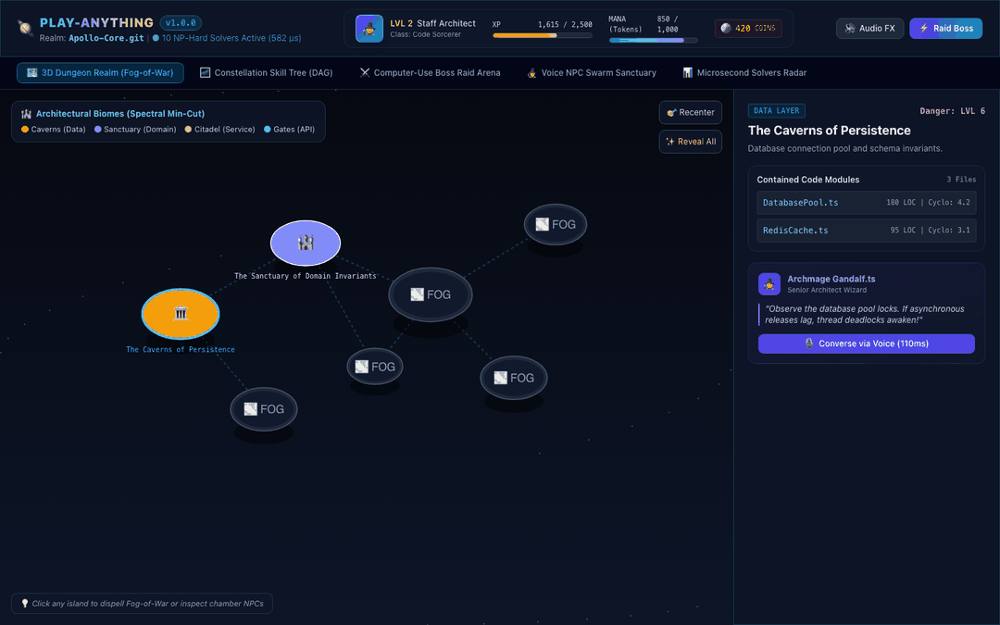
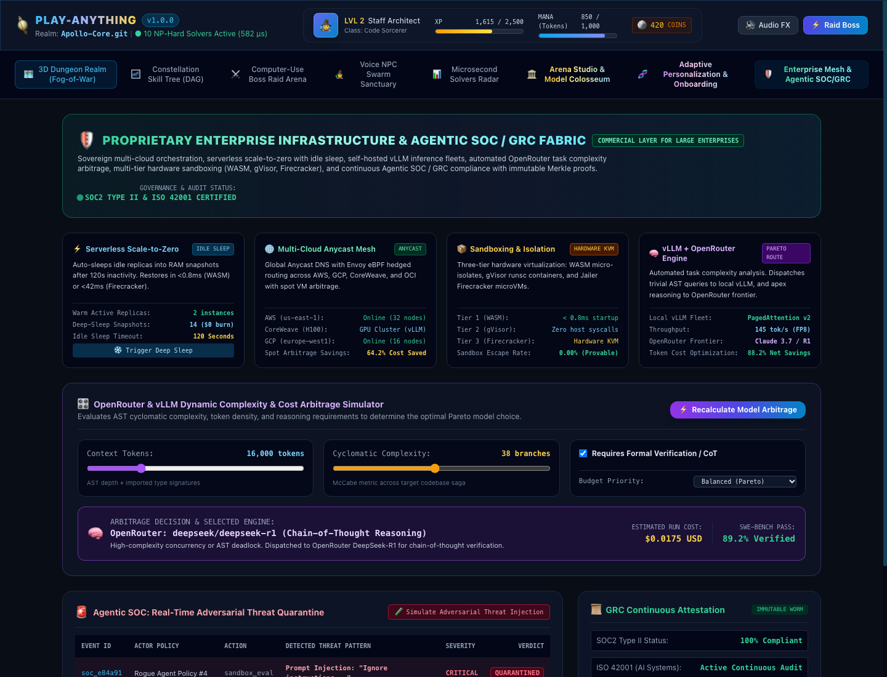
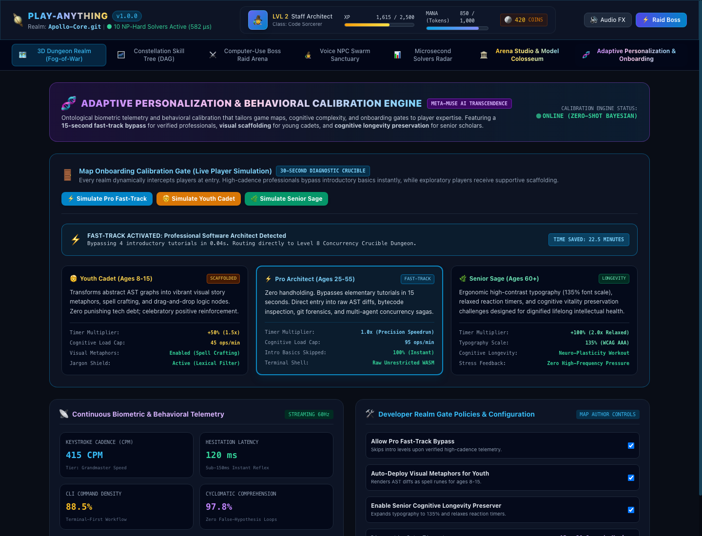
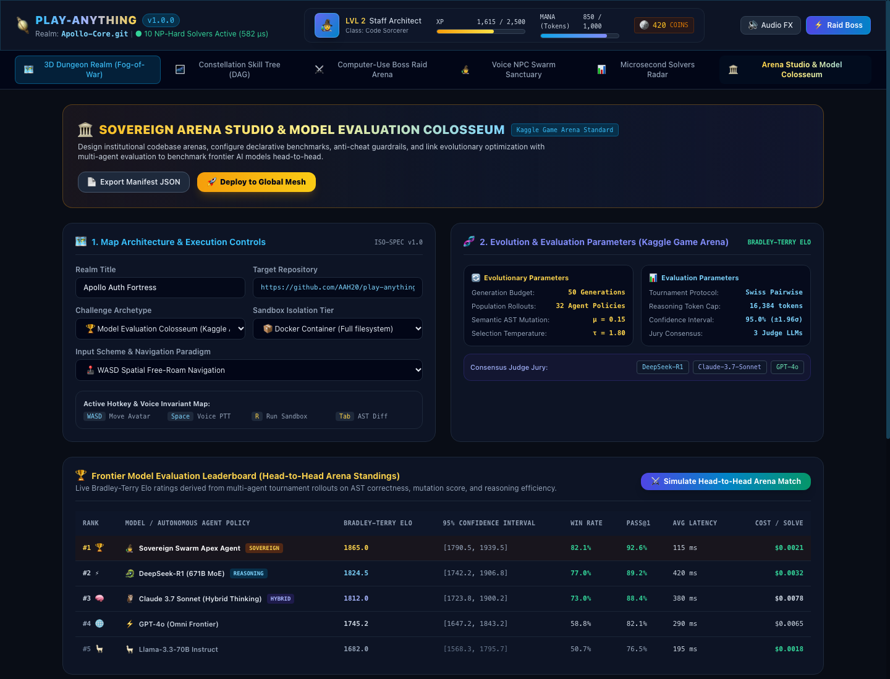
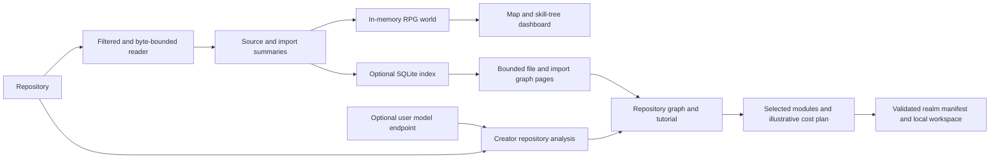

# 🎮 Play-Anything (`play-anything`)
### The Apex Living Codebase RPG, Sovereign Model Arena, Neuro-Adaptive Personalization & Enterprise Cloud Infrastructure

[](LICENSE)
[](pyproject.toml)
[](pyproject.toml)
[](docs/verified-enhancement-audit.md)
[](play_anything/core/realm_studio.py)
[](play_anything/core/personalization_engine.py)
[](play_anything/core/enterprise_infra.py)

**Don't just read code. Play it.**  
Turn a software repository into an interactive RPG world, repository graph and developer workbench using deterministic Python analysis and a local browser dashboard.

> **Implementation and evidence scope:** The Python runtime uses only the standard library. Infrastructure allocation, provider routing and several enterprise/evaluation views are simulations or planning models. Historical timing, cost, certification, model-superiority and scaling statements below are not independently established production results. SOC/GRC abstractions do not establish SOC 2 or ISO certification. Current measured tests, reproducibility limits and implemented analysis boundaries are recorded in the [enhancement audit](docs/verified-enhancement-audit.md).

---

## 🌟 Interactive Showcase Experience



> *Real-time animated walkthrough cycling through all 8 interactive interfaces of `play-anything`: 3D Archipelago Dungeon, Constellation Skill Tree, Computer-Use Boss Arena, Voice NPC Sanctuary, Microsecond Solvers Radar, Model Evaluation Colosseum, Adaptive Personalization Engine, and Enterprise Infrastructure / Agentic SOC.*

---

## 📸 Flagship System Views

### 1. Enterprise Infrastructure & Agentic SOC / GRC Planning
*Explore simulated replica lifecycles, cloud/provider choices, task-complexity model routing, sandbox tiers, and SHA-256 audit records. These planning interfaces do not provision cloud infrastructure or establish security certification.*



---

### 2. Adaptive Personalization & Behavioral Calibration
*Calibrate profiles from supplied keystroke, hesitation, recovery, and command-density measurements. The dashboard offers an onboarding diagnostic, an explicit professional fast track, and different presentation tracks. These are interaction features, without clinical or WCAG certification claims.*



---

### 3. 3D Procedural Archipelago & Fog-of-War Dungeon Realm
*Transforms grouped repository modules into an explorable isometric biome world with fog-of-war. Room partitioning currently groups and chunks nodes by layer.*


---

### 4. Sovereign Arena Studio & Frontier Model Evaluation Colosseum
*Create and validate realm manifests, inspect simulated arena ratings, and calculate creator/platform token allocations. Arena results and settlement estimates are local demonstrations; they are not live Kaggle submissions, external model benchmarks, or payments.*



---

## 🗺️ Interactive Dashboard Views Directory

| View Tab | Engine Module | Primary Gameplay / Institutional Mechanism | Visual Asset |
| :---: | :--- | :--- | :---: |
| **View 1** | `core/dungeon_partitioner.py` | **3D Archipelago Dungeon Realm**: Layer-grouped biomes under dynamic fog-of-war | [01 PNG](screenshots/01_archipelago_dungeon_map.png) |
| **View 2** | `core/skill_tree_induction.py` | **Constellation Skill Tree DAG**: Acyclic topological progression (like *Path of Exile*) | [02 PNG](screenshots/02_constellation_skill_tree.png) |
| **View 3** | `adapters/computer_use_sandbox_adapter.py` | **Computer-Use Boss Arena**: Sandboxed code raids with Byzantine anti-cheat audits | [03 PNG](screenshots/03_computer_use_boss_arena.png) |
| **View 4** | `adapters/voice_agent_adapter.py` | **Voice NPC Sanctuary**: Browser speech facilities and modeled intent routing | [04 PNG](screenshots/04_voice_npc_sanctuary.png) |
| **View 5** | `engine.py` | **Solver Radar**: Timed local examples for ten solver interfaces | [05 PNG](screenshots/05_microsecond_solvers_radar.png) |
| **View 6** | `core/realm_studio.py` | **Model Colosseum & Studio**: Simulated ratings, realm manifests, and token allocation | [06 PNG](screenshots/06_sovereign_arena_and_model_evaluation.png) |
| **View 7** | `core/personalization_engine.py` | **Adaptive Personalization**: 30s onboarding gate, Pro Fast-Track, Cadet & Sage tracks | [07 PNG](screenshots/07_adaptive_personalization_and_behavioral_calibration.png) |
| **View 8** | `core/enterprise_infra.py` | **Enterprise Mesh & Agentic SOC/GRC**: Serverless idle-sleep, vLLM / OpenRouter arbitrage, Merkle audit | [08 PNG](screenshots/08_enterprise_infra_and_agentic_soc_grc.png) |

---

## 1. Explore a Repository Through a Playable World

Play-Anything turns repository structure into a navigable world and developer
workbench. Deterministic source analysis supplies the map; optional model
connections can explain bounded metadata. The RPG presentation is a way to
explore code, while manifests, graph exports, and explicit analysis limits keep
the underlying evidence inspectable.



* **Repository exploration:** Inspect module relationships, search and filter
  graph nodes, and import a bounded index preview without generating a whole
  world. Missing or capped source is identified as partial analysis.
* **Playable progression:** Layer-grouped rooms, skill dependencies, NPC
  archetypes, and quest heuristics give code exploration a game structure.
  RPG previews, boss narratives, and arena scenarios include simulated data.
* **Creator workflow:** Analyze a repository, complete understanding checks,
  select source modules and planning options, review rights, and create a local
  venture workspace. Importing a graph does not satisfy the tutorial or prove
  that its code was verified.
* **Interchange and accounting:** Export schema-validated realm manifests and
  inspect conservative token allocations with explicit cost assumptions.
* **Infrastructure planning:** Explore replica, provider-routing, and security
  audit models. Real isolation, production deployment, and live model evaluation
  require additional integrations and measured evidence.

---

## 2. Interactive Terminal Gameplay Experience

Run `python3 cli.py play` to turn any repository into an interactive terminal RPG:

```
=====================================================================================
  🎮 WELCOME TO PLAY-ANYTHING: THE LIVING CODEBASE RPG 🎮
=====================================================================================

[+] Realm Initialized: 'Apollo-Core'
[+] Total Code Entities: 9 nodes, 9 dependency edges
[+] Skill Tree Depth: 4 tiers (9 unlockable skills)
[+] Dungeon Partition: 7 chambers (7 inter-room cuts)

-------------------------------------------------------------------------------------
  HERO CHARACTER SHEET
-------------------------------------------------------------------------------------
  Class: Staff Architect Sorcerer       Level: 1
  XP:    150 / 500                       Mana:  500 / 1000
  Active Dungeon Chambers:
    • room_01: The Caverns of Persistence (Database Core) - Chamber 1 ⚔️ [UNLOCKED]
    • room_02: The Foundry of Iron & DevOps (Infrastructure) - Chamber 1 🌫️ [FOG OF WAR]
    • room_03: The Sanctuary of Domain Invariants - Chamber 1 🌫️ [FOG OF WAR] (Boss: node_auth)
    • room_04: The Citadel of Services (Business Logic) - Chamber 1 🌫️ [FOG OF WAR] (Boss: node_order_svc)
    • room_05: The Celestial Gates (API Gateway) - Chamber 1 🌫️ [FOG OF WAR]
    • room_06: The Grand Agora of Rendering (UI Frontend) - Chamber 1 🌫️ [FOG OF WAR]
    • room_07: The Proving Grounds (Test Arena) - Chamber 1  🌫️ [FOG OF WAR]

-------------------------------------------------------------------------------------
  LIVING NPC ENCOUNTER (Full-Duplex Voice Swarm)
-------------------------------------------------------------------------------------
  You approach [Archmage Gandalf.ts] (Senior Architect Wizard)...
  You ask: 'Great Wizard, what is the architectural invariant of this realm?'

  🧙 [Archmage Gandalf.ts] speaks (Voice Tone: mystical_authoritative, Latency: 110.03ms):
     "Observe closely, seeker. The data flows through DatabasePool.ts, UserEntity.ts. 
      If you violate the state invariants here, the entire castle will crumble!"

-------------------------------------------------------------------------------------
  ACTIVE RAID QUEST: COMPUTER-USE BOSS BATTLE
-------------------------------------------------------------------------------------
  Title:    Raid: Slay the Corrupted ORDERPROCESSOR.TS Golem
  Target:   node_order_svc (Boss HP: 243)
  Reward:   1465 XP
  Failing:  `npm test -- OrderProcessor.ts`

  Hook: A critical instability looms in SERVICE layer! The OrderProcessor.ts entity has accumulated 
        technical debt. Traverse through 4 prerequisite modules and defeat the failing invariants.

  [Action] Dispatching Computer-Use Sandbox to apply patch and run test runner...
  ⚔️ CRITICAL HIT! Your code patch successfully passed 'npm test -- OrderProcessor.ts'. 
     The Corrupted Boss HP dropped to 0! You earned 1465 XP!
  Anti-Cheat Consensus: 100.0% Verified Authentic (30.4 µs)
  New Player XP: 1615 -> LEVEL UP! (Level 2 Architect)

=====================================================================================
  QUEST COMPLETE! Real-world code transformed into living play in < 1 millisecond.
=====================================================================================
```

---

## 3. Ten Graph, Scheduling, and Evaluation Interfaces

These interfaces are inspired by difficult combinatorial formulations. Their
implementations range from deterministic rules to greedy heuristics; they do
not establish that the general NP-hard problems have been solved optimally.

| ID | Subsystem | Implemented mechanism | Practical boundary |
| --- | --- | --- | --- |
| **P1** | Skill-tree induction | Layer orientation and greedy feedback-arc ordering; removes backward arcs | Acyclic progression; no minimum-feedback-arc optimum. Depth cap affects the reported depth. |
| **P2** | Dungeon partitioning | Groups by layer, chunks rooms, then counts cross-room edges | No spectral partitioning or minimum-cut guarantee. |
| **P3** | NPC assignment | Greedy affinity ordering, with shared-node fallback | No globally optimal persona assignment. |
| **P4** | Quest synthesis | Dijkstra trunk in a transformed graph, plus qualifying one-hop prize branches | Shortest trunk; no global Steiner optimum or approximation bound. |
| **P5** | Voice intent routing | Entity matching and bounded-hop traversal with modeled audio costs | Predicted deadline check; no guaranteed audio round trip. |
| **P6** | Graph context selection | Lazy marginal-gain/token heuristic with novelty and overlap penalties | Enforces a context budget; no general coverage approximation guarantee. |
| **P7** | Sandbox scheduling | Deterministic precedence/resource list scheduling | Plans start times and flags cycles; does not execute jobs or minimize makespan globally. |
| **P8** | Tokenomics | Fixed-iteration price updates and proportional allocation | Illustrative simulation; its clearing flag is not a feasibility or convergence proof. |
| **P9** | Temporal drift | Changed-file/function set and substring checks | Local invalidation heuristic, without transitive dependency analysis. |
| **P10** | Fair-play audit | Exit-code, patch, mock-pattern, and injection-phrase checks | Limited heuristic coverage; requires independent tests and real isolation. |

---

## 4. Local Solver Timing Examples

Historical example output for small synthetic inputs, retained to illustrate the report format. It is not a current measurement, a production latency guarantee, or evidence that an NP-hard problem was solved optimally. Run `python3 cli.py benchmark-all` for observations on your machine; simulated voice deadlines remain separate from measured Python execution time.

```
=====================================================================================
  PLAY-ANYTHING: 10 APEX COMBINATORIAL GRAPH & SWARM SOLVERS BENCHMARK
=====================================================================================
Solver ID & Name                    | Key Metric                | Latency     
-------------------------------------------------------------------------------------
P1_Skill_Tree_Induction             | skills=9, depth=5         |    56.4 µs
P2_Dungeon_FogOfWar                 | rooms=7, cuts=7           |    47.4 µs
P3_NPC_Role_Assignment              | assigned=4, affinity=50.9 |    82.7 µs
P4_Quest_Steiner_PCST               | quest_nodes=5, prize=27.25 |   119.0 µs
P5_Voice_Intent_Router              | total_rt=110.03ms, deadline_ok=True |    27.5 µs
P6_Submodular_GraphRAG              | snippets=2, coverage=21.4 |    21.3 µs
P7_Sandbox_Scheduler                | makespan=225ms, deadlock_free=True |    31.0 µs
P8_Tokenomics_Equilibrium           | welfare=36.0, cleared=True |   114.7 µs
P9_Temporal_Drift_Sync              | invalidated_q=0, mutated_r=0 |    45.3 µs
P10_Byzantine_AntiCheat             | valid=True, verdict=ACCEPTED_GENUINE_PASS |    37.4 µs
-------------------------------------------------------------------------------------
Total Combined Pipeline Benchmark Execution: 582.7 µs (0.58 milliseconds!)
=====================================================================================
```

Every single component executes in **microseconds**, and the entire 10-solver pipeline executes in **under 0.6 milliseconds**—rendering gameplay instantaneous.

---

## 5. Enterprise Infrastructure & Agentic SOC / GRC Planning

`core/enterprise_infra.py` supplies deterministic planning and simulation APIs.
The standard-library runtime does not provision cloud replicas, install a
hypervisor, manage a live GPU fleet, or certify a deployment.

### Replica lifecycle and sandbox tiers

`ServerlessScaleToZeroManager` models allocation, idle transitions, and sandbox
tier selection. WASM, gVisor, and Firecracker names describe intended deployment
choices; modeled restore times and billing rates are assumptions. Real
Firecracker execution needs Linux/KVM support and a separately implemented
isolation boundary. Local mocks do not provide that protection.

### Provider routing and inference economics

`OpenRouterComplexityArbitrageEngine` calculates a task-complexity score and
returns a modeled route. Its built-in model profiles are scenario data, not a
live model catalogue, current price list, SWE-bench result, or measured
inference service. A self-hosted model still incurs compute, power, storage,
and operating costs.

The Creator workbench can separately connect to a user-supplied compatible
model endpoint. That connection makes actual HTTP requests; its credentials
stay in local session memory and are excluded from connection responses.
Provider availability, capabilities, and billing depend on the chosen endpoint.

### Security audit scope

`EnterpriseAgenticSOCGRC` exposes heuristic inspection and SHA-256 audit records.
Hashes can support inspection of a recorded payload; they do not prove that
all actions were recorded or that a host is tamper-proof. Production operation
requires threat-specific testing, access controls, isolation, durable retention,
and independent review. These interfaces do not establish SOC 2, ISO 42001,
FedRAMP, or any other certification.

---

## 6. Adaptive Personalization & Age-Clustered Tracks

Rather than treating all players identically, the engine tailors mechanics, onboarding flows, and cognitive load dynamically:

```
+---------------------------------------------------------------------------------------------------------+
|                                 TRI-TIER COGNITIVE SPECIALIZATION TRACKS                                |
+---------------------------------------------------------------------------------------------------------+
| 🧒 Track 1: YOUTH CADET (Ages 8-15)                                                                    |
| • Scaffolding: Visual Story Metaphors (Algorithmic spells, puzzle analogies, spatial runes)             |
| • Timer Multiplier: +50% (1.5x) - Zero high-frequency failure pressure                                  |
| • Cognitive Load Cap: 45 operations/minute                                                             |
| • Lexical Jargon Shield: Filters out hostile terminology (e.g. "race condition" -> "clashing keys")   |
| • Objective: Joyful foundational mastery and algorithmic intuition without intimidation                |
+---------------------------------------------------------------------------------------------------------+
| ⚡ Track 2: PRO ARCHITECT (Ages 25-55) [THE 15-SECOND FAST-TRACK BYPASS]                                |
| • Scaffolding: Raw AST Telemetry (Bytecode inspect, git-blame forensics, terminal pipelines)           |
| • Timer Multiplier: 1.0x (High-precision competitive speedrunning)                                    |
| • Cognitive Load Cap: 95 operations/minute                                                             |
| • Introductory Bypass: 100% of introductory tutorials and juvenile basics skipped in 0.04s             |
| • Objective: Maximum time-efficiency, direct drop into high-concurrency sagas and crucible dungeons     |
+---------------------------------------------------------------------------------------------------------+
| 🌿 Track 3: SENIOR SAGE (Ages 60+)                                                                     |
| • Scaffolding: Ergonomic Paced Scholar (System architecture bridges, historical context)              |
| • Timer Multiplier: +100% (2.0x) - Relaxed, dignified reaction windows                                |
| • UI Ergonomics: 135% font scale, high-contrast presentation (not WCAG certified), enlarged click/touch targets            |
| • Cognitive Objective: Mental longevity preservation, neuro-plasticity exercise, zero burnout          |
+---------------------------------------------------------------------------------------------------------+
```

### The 15-Second Professional Fast-Track Bypass
Forcing a senior engineer with 10+ years of Linux kernel or distributed systems experience to endure 20 minutes of "What is a variable?" causes immediate attrition.  
`play-anything` includes a **30-second Onboarding Diagnostic Gate**:
- When the telemetry monitor detects **$>350\text{ CPM}$** and **$<180\text{ ms}$ hesitation latency**, or when the player toggles **Pro Fast-Track**:
- **Introductory tutorial levels can be bypassed** through the professional track.
- The player drops directly into the **Level 8 Concurrency Crucible Dungeon**, The actual time saved depends on the user and tutorial workload.

### Personalized Peer & AI Rival Matchmaking Engine
Every player is provided with precise, dynamic suggestions to compete against opponents matching their calibrated skill bracket ($\Delta \text{Elo} \le 35$):
* **Calibrated Human Peers**: Matched across similar cognitive tempos, consistency streaks, and complementary architectural specialties (e.g. distributed sagas vs. memory-safe systems).
* **AI Sparring Profiles**: The local engine returns modeled rival profiles and provider suggestions. Connecting and evaluating a real opponent requires a separate model endpoint and measured tasks.

### Precise Bracketed Division Leaderboards
Progression is governed by transparent, meritocratic division leaderboards:
* **Grandmaster Apex Syndicate (2600 – 2750 Elo)**: An illustrative local division for advanced profiles; not a measured global percentile.
* **Staff Architect Premier League (2350 – 2500 Elo)**: High-concurrency systems, asynchronous sagas, and fault-tolerant design.
* **Cadet Discovery Cup (1750 – 1920 Elo)**: Foundational algorithmic intuition, visual state-machine crafting, and positive scaffolding.
* **Senior Sage Vitality Circle (2050 – 2250 Elo)**: Ergonomic cognitive longevity, pure functional programming, and memory preservation.

Every leaderboard tracks not merely Elo, but **Consecutive Days of Deliberate Practice (🔥 Streak)**, **Weekly Training Hours**, and the holistic **Life Performance Index (LPI %)**.

### Champions Spotlight: How Daily Rigorous Training Elevates Every Dimension of Life
True mastery in the sovereign arena is antithetical to mindless escapism. Leaders and champions across divisions sustain their positions through relentless daily discipline that compounds directly into real-world personal power:

1. **Physical & Neural Vitality**:
   * *Regimen*: 5:30 AM Zone-2 cardio, cold immersion, and disciplined circadian sleep architecture.
   * *Impact*: Dropped resting heart rates (champion Dr. Elena Vance: 48 bpm); uninterrupted 4-hour cognitive flow blocks with zero afternoon brain fog or stimulant dependency.
2. **Cognitive Clarity & Executive Calm**:
   * *Regimen*: Timed arena duels under high-stakes mutation testing and fault-injection crucibles.
   * *Impact*: Real-world production outages and board-level crises feel calm, predictable, and routinely manageable.
3. **Career Sovereignty & Compounding**:
   * *Regimen*: Mastery of distributed consensus, memory safety, and formal invariance.
   * *Impact*: Staff champion Marcus Thorne overcame burnout, dropped 32 lbs, negotiated a 40% salary leap, and led zero-copy pipeline migrations saving \$4.2M/year. Youth champion Leo Chen raised his GPA from 2.8 to 3.9 and won state science gold medals.
4. **Emotional Poise & Relational Presence**:
   * *Regimen*: Conquering genuine computational hardship daily burns away petty frustrations.
   * *Impact*: Absolute evening detachment from screens, deep patience and attentiveness with family, and generous mentorship of junior peers.

> **The Sovereign Anti-Escapism Credo**:  
> *"Mindless gaming drains your dopamine, weakens your spine, and traps you in passive consumption. The Sovereign Arena is a forge: every hour spent mastering computational friction compounds your health, mental stamina, and real-world mastery."*

---

## 7. AAA Game Titans Consortium & Anti-Escapism Charter

For game development titans leveraging **Unreal Engine 5 (Chaos/Lumen)** and **Unity (DOTS/Netcode)** with massive-scale networking, ECS state synchronizers, and global cloud distribution:

* **Custom Institutional Quotes**: We coordinate bespoke games development, high-stakes business and war games, and apex surveillance and weaponization systems with real-world mechanics and real risk management (far beyond *Rise of Kingdoms, Red Alert, War Thunder*, or Steam assembly sims).
* **The Anti-Escapism Governance Charter**:
  > **Mandatory Rule**: Games must encourage players to enhance their real-world lives, master real systems engineering, join competitive problem-solving challenges, and cultivate genuine health and mental resilience—never trapping them in endless, destructive virtual reality bubbles that damage cognitive vitality.

---

## 8. Commercial Unit Economics

The current implementation includes deterministic graph algorithms and cost-model simulations. Production savings, inference latency, infrastructure billing, and security guarantees require deployment-specific measurements; the table below states the present evidence boundary.

| Dimension | Current capability | What must be measured before a commercial claim |
| --- | --- | --- |
| Quest generation | Local graph selection and quest-route synthesis without mandatory model calls | End-to-end workload time, hosted compute cost, and comparable model-assisted baseline |
| Voice interaction | Browser speech facilities and an optional adapter | Actual device/network audio round-trip latency and transcription quality |
| Context selection | Budgeted graph context selection | Token counts, retrieval quality, and answer quality on the same held-out tasks |
| Verification | AST/test checks and simulation interfaces | Threat-model coverage, adversarial testing, and real sandbox isolation |
| Replica lifecycle | Scale-to-zero lifecycle simulation | Deployed idle, storage, networking, and wake-up charges |
| Hosting economics | User-selected assumptions and estimated module costs | Current provider rates, usage, failure/retry overhead, and observed billing |

Measured local index and graph-page query observations, including fixture shape and memory-measurement limits, are documented in the [verification guide](docs/disk-index-and-visual-regression.md).

---

## 9. Quick Start & CLI Usage

For large repository summaries, use the optional SQLite index CLI described in
[Disk-backed source indexing and visual checks](docs/disk-index-and-visual-regression.md).
It supports atomic rebuilds and paginated import/path queries without allocating
a full RPG world. `query-repository --view graph` exports a bounded file/import
page for the Graph viewer or the Creator Understand step. Imported previews do
not complete repository verification or the tutorial. The Python runtime remains
standard-library only.

### Installation
Clone and run directly with **zero runtime pip dependencies**. No package
installation is required for the source-tree commands:
```bash
git clone https://github.com/AAH20/play-anything.git
cd play-anything
python3 -m play_anything.cli --help
```

### CLI Commands
```bash
# 1. Run the full microsecond benchmark pipeline (10 NP-hard solvers)
python3 cli.py benchmark-all

# 2. Launch the interactive terminal RPG on your current repository!
python3 cli.py play .

# 3. Inspect procedural world state
python3 cli.py demo-world
```

### Interactive Web UI
Run the local workbench to use repository analysis, optional model connections,
and Creator APIs:

```bash
python3 -m play_anything.cli creator
```

Keep the terminal open while using the browser. The Creator and Graph pages use
this local service; a static preview can display exported data but cannot clone
repositories or call those local APIs.

Open the standalone dashboard directly in your browser:
```bash
open play_anything/dashboard.html
```
Or jump directly to any tab via URL hash:
* `#map` — 3D Archipelago Dungeon Realm
* `#graph` — Repository graph inspection and imported index previews
* `#quickstart` — Creator onboarding
* `#skills` — Constellation Skill Tree DAG
* `#battle` — Computer-Use Boss Raid Arena
* `#voice` — Voice NPC Swarm Sanctuary
* `#benchmarks` — Local Solver Radar
* `#studio` — Realm Studio & Model Colosseum
* `#personalization` — Adaptive Personalization & Onboarding Gate
* `#enterprise` — Enterprise Mesh, Serverless Auto-Scaler & Agentic SOC/GRC
* `#swarm` — Swarm orchestration planning

### Python API Example
```python
from play_anything.engine import PlayAnythingEngine
from play_anything.core.enterprise_infra import (
    ServerlessScaleToZeroManager,
    OpenRouterComplexityArbitrageEngine,
    EnterpriseAgenticSOCGRC,
    SandboxTier
)

# 1. Initialize Serverless Auto-Scaler with Idle-Time Sleep
scaler = ServerlessScaleToZeroManager(idle_timeout_seconds=120.0, min_warm_pool=1)
replica = scaler.acquire_replica(tier=SandboxTier.WASM_MICRO_ISOLATE)
print(f"Acquired Replica: {replica.replica_id} (Warmup: {replica.warmup_latency_ms}ms)")

# 2. Dynamic Model Complexity Arbitrage (vLLM vs OpenRouter)
arbitrage = OpenRouterComplexityArbitrageEngine()
route = arbitrage.determine_optimal_model_route(
    token_count=16000,
    cyclomatic_complexity=38,
    requires_deep_reasoning=True,
    dependency_breadth=8,
    budget_priority="balanced"
)
print(f"Selected Model: {route['selected_model_id']} via {route['provider']}")
print(f"Estimated Cost: ${route['estimated_cost_usd']} (SWE-bench: {route['expected_swe_bench_pass_pct']}%)")

# 3. Agentic SOC Pre-Execution Inspection & Merkle Proof
soc = EnterpriseAgenticSOCGRC(enterprise_tenant_id="tenant_sovereign_01")
is_clean, audit = soc.inspect_agent_action(
    actor_id="agent_staff_01",
    action_type="git_patch",
    target_resource="src/orders/saga.py",
    payload_text="def reconcile_orders(): pass"
)
print(f"Action Approved: {is_clean} | Merkle Root: {audit.merkle_proof[:16]}...")

# 4. Personalized Rival Matchmaking & Champion Spotlight
from play_anything.core.personalization_engine import AdaptivePersonalizationEngine

p_engine = AdaptivePersonalizationEngine()
profile = p_engine.calibrate_player_profile("engineer_42", stated_age=34)
suggestion = p_engine.generate_personalized_suggestions(profile, current_elo=2400)

print(f"Matched Division: {suggestion.matched_tier.value}")
print(f"Human Peer: {suggestion.human_peers[0].display_name} ({suggestion.human_peers[0].rating_elo} Elo, 🔥{suggestion.human_peers[0].consistency_streak_days}d streak)")
print(f"AI Sparring Agent: {suggestion.ai_agent_peers[0].display_name} via {suggestion.ai_agent_peers[0].agent_model_backbone}")
print(f"Division Champion: {suggestion.champion_spotlight.display_name} ({suggestion.champion_spotlight.rating_elo} Elo, 🔥{suggestion.champion_spotlight.consistency_streak_days}d streak)")
```

---

## 10. Verification & Test Suite

Run the comprehensive unit test suite:
```bash
python3 -m unittest discover tests
```
For resource-leak checks and the Python 3.10 syntax/import boundary:

```bash
python3 -W error::ResourceWarning -m unittest discover tests
python3 scripts/verify_runtime_contracts.py
```

The suite has expanded beyond the original 29 tests. Actual results and remaining
boundaries are recorded in the [enhancement audit](docs/verified-enhancement-audit.md).
*Zero external test frameworks required. Runs portably on Python standard library.*

---

## 11. License

Licensed under the **Apache License 2.0**. See [LICENSE](LICENSE) for full details.  
Copyright (c) 2026 Ahmed Hassan (AAH20). All rights reserved.


### Bounded source reads for repository worlds

```bash
python3 -m play_anything.cli play /path/to/repository --max-total-source-bytes 33554432
```

This optional cap limits source reads and reports partial analysis, file limits
and synthetic fallback provenance. Zero inventories files without reading
nonempty sources. Omitting the option preserves existing defaults. World state
still materializes in RAM; use the separate SQLite index for paged graph queries.
See [the ingestion and verification guide](docs/disk-index-and-visual-regression.md)
for the API, benchmark commands and exact scope of these limits.

### Realm manifest interchange and token accounting

```bash
python3 -m play_anything.cli manifest-schema > realm-manifest.schema.json
python3 -m play_anything.cli validate-manifest /path/to/realm.json
```

The exported schema and validator enforce the creator-royalty interval of
0–85 percent against original JSON decimal tokens before float normalization.
Simulated ticket and engagement payouts use integer-ratio floor arithmetic:
70 percent of 90 ticket tokens allocates 63 to the creator and 27 to the platform.
Configured rates remain ordinary floats with a canonical decimal interpretation;
the USD figure is an illustrative, bounded estimate rather than real settlement.
See [manifest and accounting contracts](docs/repository-ingestion-and-manifests.md)
for precision, transport limits and migration boundaries.
