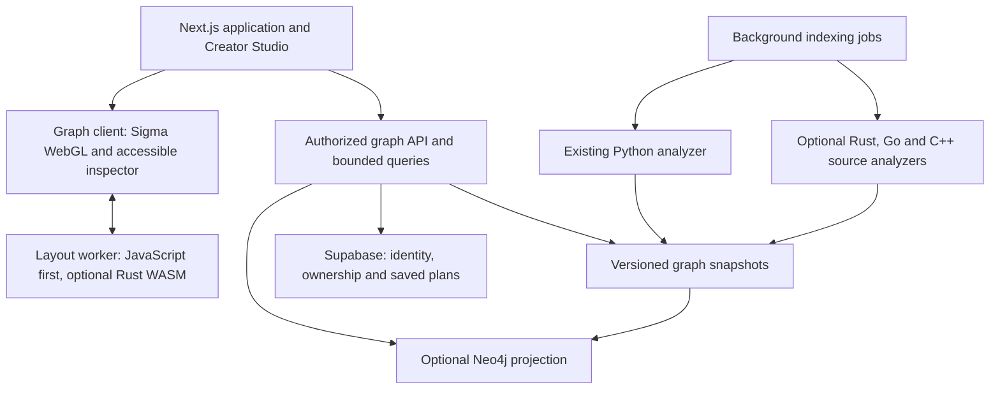

# Next.js, graph intelligence and native compute: architecture and migration plan

Status: proposal, 2026-09-27. Requested priority: **graph navigation and layout**. No application migration, dependency installation, database provisioning or native rewrite is included in this planning step.

## Recommendation

Add an optional Next.js/TypeScript application around the existing Python engine. Build the graph experience with Sigma.js/WebGL, Graphology and background layout workers. Keep graph storage behind an adapter; add Neo4j/Cypher when persistent cross-repository traversal justifies it. Use Rust/WASM for measured browser computation bottlenecks. Reserve Go for background ingestion/event services and C++ for compiler/game-engine integrations.

This gives each technology a distinct job. Adding all three native languages to the browser interaction path would add interfaces, builds and failure modes without establishing lower latency. Next.js supplies application structure; visual polish still comes from consistent navigation, accessible controls, loading/error states and a coherent design system.

The optional application introduces npm/build dependencies. The current Python installation, public interfaces and stdlib-only runtime remain independently usable. This is an extension to the repository's packaging policy, not a claim that Next.js is dependency-free.

## Grounded starting point

The current project has no Next.js package, Cargo workspace, Go module or CMake project in the inspected source inventory. `core/repository_graph.py` builds a graph with Python AST evidence and explicitly weaker JavaScript/TypeScript hints. `graph-viewer.js` filters and sorts graph data, then redraws an SVG page of at most 36 nodes. It is currently a paginated grid, not a force-directed layout engine. Its main-thread graph scans and DOM reconstruction are candidates for profiling, not proven bottlenecks yet.

One local three-run indexing probe produced:

| Measurement | Observed result |
|---|---:|
| Indexed files | 82 |
| Nodes / relationships | 456 / 1,309 |
| Serialized JSON | 442,089 bytes, uncompressed |
| Indexing time | 100.07, 86.00, 84.74 ms |
| Median | 86.00 ms |

These measurements include current local indexing work. They do not measure browser frame time, network latency, cold-start behavior or large-repository performance. Three runs cannot establish a p95/p99 or a capacity claim. The existing 73 unit tests pass; this turn's baseline ran in 0.057s, above the charter's strict 0.05s target.

## Proposed component boundaries



The pan/zoom/hover path stays entirely in the browser against already loaded data. It does not wait for a database, remote model or server round-trip. Expanding an unloaded neighborhood is a separate asynchronous operation with progress and cancellation. [Next.js supports server-rendered application surfaces with focused interactive client components](https://nextjs.org/docs/app/getting-started/server-and-client-components).

Suggested future layout:

```text
apps/web/                  Next.js routes and polished application UI
packages/graph-contract/   Versioned types, validation and fixtures
packages/graph-client/     Renderer, inspector, selection and worker bridge
packages/graph-storage/    Snapshot/Postgres/Neo4j adapters
native/graph-kernel/       Optional Rust library and WASM build
services/graph-jobs/       Optional Go indexing/event service
native/clang-indexer/      Optional C++ semantic analysis tool
play_anything/             Existing independent Python package
```

These directories are proposed, not scaffolded.

## Graph database, query language and renderer are different choices

| Concern | Recommended choice | When to reconsider |
|---|---|---|
| Browser rendering | Stable Sigma.js + Graphology | Specialized diagram editing may need a different interaction library |
| Graph layout | Worker-based ForceAtlas2 for exploration; deterministic module grouping for explanation | Add a native kernel only after profiling |
| Initial persistence | Versioned JSON snapshots and existing Postgres ownership metadata | Frequent large multi-hop queries or cross-repository analysis |
| Optional graph database | Neo4j | Benchmark its query value against operational and synchronization costs |
| Property-graph queries | Cypher | An existing TinkerPop deployment may favor Gremlin |
| Standards vocabulary | Track GQL support explicitly | Do not assume every GQL feature works across vendors |
| Semantic-web data | RDF + SPARQL only if ontology interoperability is required | Not the default for this code dependency explorer |

There is no single “apex” graph programming language. [Cypher](https://neo4j.com/docs/getting-started/cypher/) is a practical fit for the proposed Neo4j property graph; Neo4j documents [specific GQL conformance and gaps](https://neo4j.com/docs/cypher-manual/current/appendix/gql-conformance/). [Gremlin](https://tinkerpop.apache.org/gremlin.html) emphasizes traversal, while [SPARQL](https://www.w3.org/TR/sparql11-query/) queries RDF. GraphQL is an API query technology and is not a replacement for graph storage or graph layout.

[Sigma](https://www.sigmajs.org/docs/) uses WebGL with Graphology. Its documentation currently identifies v4 as alpha; select a stable compatible release during implementation. [Graphology's ForceAtlas2](https://graphology.github.io/standard-library/layout-forceatlas2.html) provides a worker implementation and Barnes–Hut optimization. These are useful baselines before writing a custom solver.

## Data model and evidence quality

Model repositories, revisions, directory modules, files, symbols and external packages. Relationships include `CONTAINS`, `DEFINES`, `IMPORTS`, `CALLS` and `INHERITS`. Introduce `TESTS` or `DEPENDS_ON` only when their evidence rules are defined; a naming coincidence must not become a verified test relationship.

Every entity/edge needs repository and snapshot identity, source location when applicable, analyzer/version, evidence type and confidence. Add stable logical symbol keys where language information allows it; the current line-containing IDs should not be the only identity across edits. Test overloaded names, duplicate declarations, moves and ambiguous rename matching. Preserve the current format with a versioned adapter.

Keep immutable snapshots as the recoverable source for graph projections. Index Neo4j by tenant/repository/revision and stable IDs. Project a completed revision atomically or publish its revision pointer only after completion. Retry indexing idempotently; never mix edges from partially indexed revisions. If Neo4j is unavailable, show the last complete snapshot with its timestamp.

Browser requests use predefined operations such as `overview`, `neighborhood`, `path` and `impact`, not unrestricted client-submitted Cypher. Validate authorization separately for Neo4j: Supabase row-level security does not automatically protect another database. Bound traversal depth, returned nodes/edges and query duration; parameterize values and partition caches by tenant and revision. Neo4j credentials stay server-side.

New source-language support is a separate workstream from native acceleration:

- [Tree-sitter](https://tree-sitter.github.io/tree-sitter/) can provide incremental syntax trees for Rust, Go and C++; syntax trees alone do not prove resolved calls.
- Go semantic enrichment can use [`go/types`](https://pkg.go.dev/go/types).
- C++ enrichment can use [Clang LibTooling](https://clang.llvm.org/docs/LibTooling.html) with explicit compilation context.
- Rust enrichment can evaluate [rust-analyzer](https://rust-analyzer.github.io/book/) interfaces against fixture repositories.

Compiler-backed analysis must not silently execute repository build scripts, procedural macros or arbitrary project commands. Use isolated jobs and explicit capabilities where richer analysis requires them. Unresolved relationships remain visible as unresolved.

## Latency design and measurable targets

The objective is responsive interaction, not hard real-time scheduling. Rust removes garbage-collection dependence in its own code, but browser scheduling, GPU work, memory transfers and network delays still exist. No chosen language can guarantee “no delay.” [Rust's performance model](https://rust-lang.org/) and [Go's documented GC latency sources](https://go.dev/doc/gc-guide) support choosing different roles for them.

The following are **proposed acceptance targets**, not achieved measurements or an SLA. Hardware, browser, graph density and concurrent activity must be recorded with results.

| Operation | Initial target | How to measure |
|---|---|---|
| Warm pan/zoom | p95 frame interval ≤16.7 ms on agreed 60 Hz desktop; ≤33.3 ms on agreed lower-end device | Frame traces during a fixed 30-second interaction script |
| Loaded-node selection | p95 input-to-highlight ≤50 ms | Event timestamp through the next painted selection |
| Cached neighborhood expansion | p95 ≤100 ms | Click to usable nodes, including layout handoff |
| First usable layout | Target ≤1 s for a 5k-node/20k-edge desktop fixture | Worker start to the first navigable layout; convergence measured separately |
| Expensive analysis | Asynchronous, cancelable, bounded | Queue time, compute time, transfer time and peak memory separately |

Benchmark real and synthetic graphs: this repository, 1k/5k/20k nodes, sparse and dense edges, hubs, cycles, disconnected components and long identifiers. Repeat enough interactions to report p50/p95/p99 plus worst observed stalls. Compare cold and warm states. On larger graphs, render module/community summaries and expand local neighborhoods instead of forcing every label and edge onto the screen.

Design changes before a native port:

1. Build incoming/outgoing adjacency indexes once per snapshot; avoid scanning all edges for every selection.
2. Keep node coordinates and GPU buffers outside React component state. React owns controls, selection identity and the inspector; it should not reconcile every layout tick.
3. Run layout/filter computation in workers with transferable typed arrays. Batch messages rather than copying full JSON graphs each frame.
4. Cancel superseded jobs, use request/revision IDs to discard stale results, and reuse existing positions during updates.
5. Bound iterations and memory. Preserve the last useful layout when the budget is exhausted; resume only when useful.
6. Use deterministic initialization and fixed iteration counts in test fixtures. Approximate layout coordinates need tolerance-based checks, not cross-platform bitwise equality promises.
7. Keep an accessible searchable list/inspector alongside the canvas and respect reduced-motion preferences.

## Rust, Go and C++ module responsibilities

| Proposed module | Concrete responsibility | Acceptance gate |
|---|---|---|
| Rust `graph-kernel` | Compact adjacency construction, neighborhood extraction, strongly connected components, aggregation and optional layout kernels; WASM worker in browser, native binary for batch analysis | Differential correctness against reference fixtures; bounded allocations; cancellation; end-to-end performance win including serialization and WASM startup |
| Go `graph-jobs` | Bounded indexing job queues, concurrency limits, snapshot delivery, progress/events, cancellation and graceful shutdown | Load tests for backpressure, tenant isolation and p95/p99 service latency; no claim of hard real-time scheduling |
| C++ `clang-indexer` | Accurate C/C++ declarations and source relationships using compilation context; optional native game-engine integration later | Compiler fixtures, toolchain compatibility, sanitizers and isolated execution; no inclusion in browser frame loops |

Implement Rust first only if the JavaScript worker baseline misses agreed budgets. Add Go when concurrent indexing requires a dedicated service. Add C++ when compiler/game-engine integration requires it. Do not implement equivalent graph kernels in both Rust and C++ merely to include both languages.

If a future audio/game callback truly has a hard deadline, treat it as a separate native subsystem: explicit worst-case execution analysis, preallocated buffers, bounded work and an appropriate OS/runtime. [Clang RealtimeSanitizer](https://clang.llvm.org/docs/RealtimeSanitizer.html) can help detect inappropriate operations in annotated C++ real-time code; it does not prove an end-to-end deadline guarantee.

## Hosting and unit economics

The current static deployment remains a fallback. A Next.js application adds a different deployment mode:

- Vercel is the first proposed full-stack target for the optional Next.js app. Keep long indexing jobs and native daemons outside request functions.
- A static Next.js export can continue using Cloudflare Pages, with server-only features moved to an external API.
- For full-stack Cloudflare, verify the current Workers framework path and compatibility. As checked on 2026-09-27, [Cloudflare recommends vinext](https://developers.cloudflare.com/workers/framework-guides/web-apps/nextjs/); OpenNext remains documented for existing applications with compatibility gaps. Do not assume the existing Pages configuration supports Next.js server execution.
- Neo4j and persistent Go/C++ services require their own hosting/capacity choices. They are not included automatically in a Vercel, Pages or Supabase subscription. [AuraDB](https://neo4j.com/product/auradb/) is a managed option to evaluate, not a provisioned dependency.

Creator phases 3 and 4 should eventually expose these separately selectable options: Next.js application, WebGL graph experience, Neo4j persistent graph, Rust acceleration, Go job service and C++ semantic analysis. Show compatibility, prerequisites and measured-benefit status beside each option.

For each option, estimate setup labor/build tooling, monthly reserved capacity, metered CPU/request/egress costs and maintenance. Allocate shared costs once; keep direct incremental costs separate from allocated reporting costs. Example formulas:

```text
Indexing variable cost = completed jobs × average billable compute seconds × unit rate
Graph delivery cost = uncached responses × average compressed bytes × egress rate
Native hosting cost = reserved instance hours × instance rate + incremental usage
Graph DB cost = chosen capacity + storage/backups + applicable usage charges
Cost per graph session = attributable monthly graph costs / active graph sessions
```

Browser WASM has no server invocation fee by itself, but adds bundle transfer, build/test work and user-device resource use. Neo4j may introduce a fixed cost floor and projection maintenance. Faster code does not necessarily lower a bill if reserved infrastructure remains unchanged. Enter current provider quotes and measured workload inputs at implementation time; do not label native features free or assume speculative savings.

## Migration phases and release gates

| Phase | Deliverable | Gate before proceeding |
|---|---|---|
| 0. Contracts and baseline | Versioned graph contract, real fixtures, browser benchmark harness, latency/device targets | Reproducible correctness and performance reports; Python interfaces unchanged |
| 1. Optional Next.js app | Shared navigation, graph/Creator routes, accessibility, loading/error handling; reuse accounting contracts | Existing onboarding, pitch, export and module selection flows pass end-to-end; legacy application remains launchable |
| 2. Graph experience | Sigma renderer, worker layout, adjacency indexing, LOD, incremental updates and inspector | Agreed interaction targets on benchmark matrix; memory limits and cancellation tested |
| 3. Persistent graph | Storage adapter, bounded queries, optional Neo4j projection, revision-aware caching | Authorization/tenant isolation tests, projection recovery, query benchmarks and cost comparison |
| 4. Rust acceleration | Only the measured hot operations behind the worker contract | Clear end-to-end improvement over JS baseline and correctness parity; fallback remains functional |
| 5. Go/C++ modules | Dedicated job service and semantic compiler integrations when justified | Independent build/test pipelines, realistic load tests and operational ownership |

Keep routing/rendering/storage/compute changes independently reversible. Use explicit feature selections for the new app, renderer, storage provider and worker implementation. Lock dependency versions during implementation and exercise both deployment targets before claiming compatibility.

The immediate implementation recommendation is **phases 0–2**. They directly address the stated graph-navigation priority. Neo4j is a query/persistence upgrade; native services become justified by measured workload or semantic-analysis needs.
