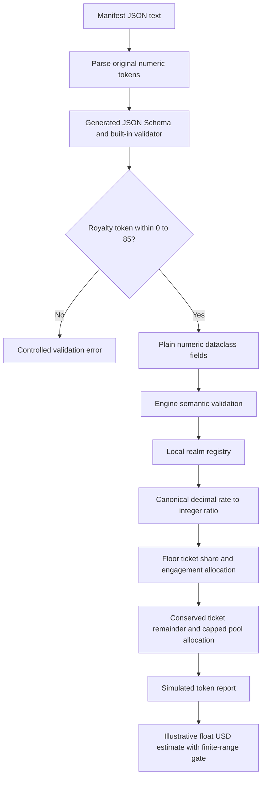

# Repository ingestion and manifest validation

The runtime remains Python 3.10+ standard library only.

## Manifest contract

`schemas/realm-manifest.schema.json` is the exported Draft 2020-12 structural
contract. It is derived from the existing dataclasses, so required constructor
arguments are required properties and fields with defaults remain optional.
Unknown fields, wrong nested types, invalid enum values, non-string map keys,
and non-finite numbers are rejected. JSON Schema integer semantics allow `512.0`
but reject `512.5` and booleans for an integer property.

```python
from play_anything.core.realm_studio import RealmManifest, RealmStudioEngine

studio = RealmStudioEngine()
manifest = studio.create_template_manifest("Example Realm", "Author", "local")
payload = manifest.to_json()
restored = RealmManifest.from_json(payload)
errors = RealmManifest.validate_dict(restored.to_dict())
schema = RealmManifest.json_schema()
business_result = studio.validate_manifest(restored)
```

`from_dict` validates before conversion and does not modify or retain references
to the caller's nested dictionaries. It now raises `ValueError` with field paths
for malformed inputs. `from_json` also rejects malformed JSON. Existing valid
manifests and nested defaults continue to work.

The built-in validator implements only the keywords emitted by this schema;
it is not an arbitrary JSON Schema engine. The exported schema and built-in
validator enforce the inclusive 0–85% creator revenue-share range. Business rules
such as minimum title length and mandatory objectives remain in
`RealmStudioEngine.validate_manifest`, which also checks that range when given a
dataclass directly. Structural validity alone is not approval to publish; export
does not imply arbitrary format checks or additional numeric business bounds.

After changing manifest dataclasses, regenerate the schema:

```bash
python3 - <<'PY'
import json
from pathlib import Path
from play_anything.core.realm_studio import RealmManifest
Path('schemas/realm-manifest.schema.json').write_text(
    json.dumps(RealmManifest.json_schema(), indent=2) + '\n'
)
PY
```

The schema regression test detects a stale export.

## Incremental scanning

```python
from play_anything.adapters.repository_index import iter_repository_summaries
from play_anything.adapters.repo_rpg_generator import RepoRPGGenerator

# Consume summaries without materializing the full graph.
for summary in iter_repository_summaries(
    ".", max_files=None, cache_path="/tmp/play-anything-index.sqlite",
    cache_max_entries=10000,
):
    print(summary["path"], summary["analysis"])

# Existing callers keep the 50-file default and the WorldState return type.
world = RepoRPGGenerator.scan_local_directory(
    ".", cache_path="/tmp/play-anything-index.sqlite"
)
```

The iterator sorts directories and files, skips excluded directories and symlink
files, and reads/parses one source file at a time. Explicit `max_files=None`
removes the file-count cap; nonpositive or noninteger limits raise `ValueError`.
Close a partially consumed iterator when using the cache so its connection is
released promptly. No database is created unless a cache path is supplied.

Python summaries measure LOC and estimate file-level decision complexity from
the AST. Static imports resolve within the scanned files for root and `src`
layouts, including relative imports and package initializers. Edges point from
dependency to importer to match progression direction. External, dynamic, and
ambiguous imports do not produce guessed edges. Complexity is an approximation,
not a certified cyclomatic metric or vulnerability analysis.

Other supported languages have measured LOC, baseline complexity, and an
`unparsed_language` tag. Syntax/encoding failures use `python_parse_error`;
unreadable files use `unreadable_file`. Filename-based layer classification is
retained. Fabricated adjacency edges and filename-based vulnerability scores
have been removed. Consequently, real graphs can be disconnected; the existing
quest solver's fallback path is gameplay scaffolding, not proof of a code dependency.

Cache keys include repository identity, relative path, parser version, and a
SHA-256 content hash. A cache hit avoids AST parsing but still reads/hashes bytes
to detect edits independent of modification timestamps. Least-recently-used
entries are pruned to the configured row limit. Deleted files are not yielded;
their old cache entries may remain until eviction. The limit bounds row count,
not database bytes. SQLite failures propagate to the caller.

World generation still materializes nodes, summaries, and edges because current
solvers require lists. One large file must also fit in memory. This change does
not establish million-line scalability; that needs profiling and later solver work.

## Verification

Run `python3 -m unittest discover tests`. New cases cover schema drift,
serialization, defaults, malformed values, caller-data preservation, AST metrics,
relative imports, encoding, fallbacks, limits, cache identity/invalidation/eviction,
and lazy iteration. Compile changed Python files with `python3 -m py_compile`.


### Exact JSON integer semantics

Manifest JSON validation checks decimal tokens before ordinary floating-point
rounding can disguise a fraction as an integer. Mathematically integral forms
such as `512.0` and `5.12e2` remain valid for integer fields; a token slightly
greater than 512 is rejected even if a binary float would round it to 512.
Exactly representable integral decimal forms retain their prior plain-float
values. An integral token whose value would be lost through float rounding
becomes an exact Python integer, including counters above JavaScript's
safe-integer range. Float fields remain ordinary finite floats;
this does not introduce arbitrary-precision cost arithmetic or browser numeric
precision. Public dataclass values do not retain parser wrapper types.

Integral exponential tokens are bounded by the interpreter's integer-digit
limit before conversion: `1e309` is supported as an exact integer, while
`1e1000000000` raises a controlled validation error. This is a resource bound,
not a claim that every arbitrarily large JSON number is supported.

The royalty field now exports JSON Schema `minimum: 0.0` and `maximum: 85.0`.
JSON validation compares the original decimal token to those bounds before
normalization, so a token microscopically above 85 or a negative token that
would round to negative zero is rejected. Valid dataclass values remain plain
floats. Invalid royalty inputs now fail at the structural interchange boundary;
directly constructed dataclasses retain the engine's semantic range backstop.

An exact financial contract should define its serialized precision, units and
rounding mode before implementation. Acceptance cases should include exact
ceiling values, a value one supported unit above the ceiling, negative values,
conversion/serialization round trips, and repeated revenue distributions that
conserve the original total. Keep the current float contract explicitly
versioned during migration rather than silently changing existing dataclass
values or claiming that larger model budgets improve arithmetic correctness.

### Simulated token payout rounding

Ticket splits and engagement-pool payouts use exact integer-ratio floor
arithmetic based on the canonical decimal spelling of the configured float
rate. At 70 percent, 90 ticket tokens allocate 63 to the creator and 27 to the
platform; the previous binary-float product could allocate 62. At 33.3 percent,
1,000 tokens allocate 333. The platform receives the ticket remainder, which
preserves the original ticket total. Engagement payout uses the same floor
policy for its formula and 15-percent pool cap; 2 plays at 50-percent completion
from a 1,000,000-token pool allocate 21 tokens.

These are in-memory simulated token units. The canonical decimal spelling is
not arbitrary-precision retention of every original JSON percentage token.
`estimated_settlement_usd` remains an illustrative float estimate using the
assumption of USD 0.01 per token, not a market quote or real settlement. Inputs
outside that estimate's current finite-number gate return a controlled error;
exact integer allocation does not imply unbounded end-to-end currency support.

### Creator and agent JSON body boundaries

Model endpoint API keys are checked before constructing HTTP requests. Header
control characters and characters outside the header encoding are rejected
with a controlled error that does not echo the supplied key.

The local Creator POST API supports Content-Length framing only. It rejects
any Transfer-Encoding header before reading the body or dispatching work,
including requests containing both headers. Clients must send one validated
Content-Length matching the UTF-8 JSON byte count.

Creator request bodies retain their 200,000-byte limit, and agent response
bodies retain their 1,000,000-byte limit plus one overflow-detection byte.
Both reject duplicate object keys, non-finite numeric constants/exponents and
more than 64 nested containers. Quoted or escaped brackets are ordinary string
data. The nesting check runs before decoding, so supported Python versions
produce controlled errors rather than decoder-dependent recursion failures.
Ordinary finite JSON float values still use binary floats; this transport check
does not provide exact monetary interchange.

Agent response body reads retain their existing absolute deadline after headers.
Consuming a complete HTTP response may close its socket: the reader finishes
without an extra read and ignores only `EBADF` while restoring that already
closed socket's timeout. Other transport and timeout errors remain visible.

### Implemented validation and payout flow



This manifest-text path preserves source tokens only through structural
validation. It is separate from generic HTTP JSON decoding, which normalizes
finite numbers to ordinary Python numbers. Neither path promises arbitrary
original-token precision throughout a financial system.
