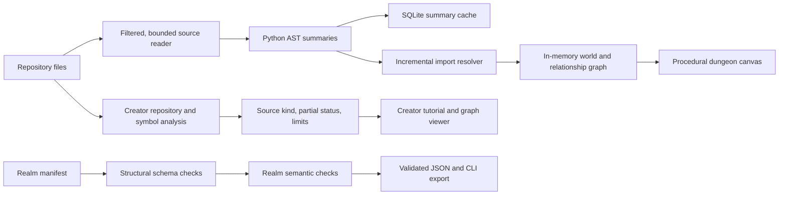

# PlayAnything: verified enhancement audit

Audit date: 2026-10-01. This report records implemented behavior and verification
limits. It does not establish competitive superiority or exact solutions to
NP-hard optimization problems.

## Architecture and changes



### Repository analysis

- Invalid repository paths raise explicit filesystem errors. Traversal errors
  propagate instead of producing a falsely complete scan.
- The summary index caps source files at 2 MiB by default, including a bounded
  read that handles growth after the size check. `max_file_bytes=None` explicitly
  disables this limit. Oversized files carry `source_too_large`; zero lines and
  fallback complexity are not measured AST evidence.
- World generation no longer retains the complete list of file summaries.
  Import resolution indexes paths and records imports incrementally. Tests check
  collection of earlier summaries and preserve relative-package/import edges.
- SQLite writes use batches of at most 64 pending summaries, commit before
  yielding, enforce the configured cache limit, and flush on explicit iterator
  close or traversal failure. Cached content identity and multi-root behavior
  remain covered by tests.
- Hidden directories and dot-prefixed files are excluded from source ingestion.
  This is an exclusion rule, not comprehensive secret detection.
- Empty-directory world fallback remains compatible and marks every fabricated
  sample node with `provenance:synthetic_fallback:no_analyzable_files`.
- Creator reports and graphs expose complete/partial status, analyzed and skipped
  counts, file and symbol caps, byte caps, and source kind. A bundled checkout scan
  is distinguished from a synthetic demo and from a supplied repository.
  Exact file/symbol cap matches are not claimed as truncation without omission.

### Contracts, algorithms, and API boundaries

- Realm JSON rejects duplicate keys at every object depth. CLI schema export and
  validation return useful errors and nonzero statuses; the repository-root CLI
  propagates these statuses. Semantic validation rejects impossible memory/CPU
  budgets in addition to structural checks.
- Creator HTTP requests reject malformed UTF-8/JSON, duplicate keys, nonfinite
  numbers, invalid body lengths, non-object payloads, and invalid analysis IDs.
  Workspace setup and clone errors use actionable messages without local paths.
  Client sockets have a 15-second inactivity timeout. Body reads additionally
  have a 60-second total deadline; this does not bound header parsing or the
  entire dispatched operation. Atomic reservations cap
  retained analyses and connections at ten each by default; reaching capacity
  prompts export and session restart without evicting or deleting workspaces.
  These caps count retained records and creation reservations, not clone bytes
  or concurrent explanation calls over existing connections.
- Scheduling validates identities, dependencies, and timing; deterministic ties
  preserve release, precedence, and exclusive-resource constraints. This is a
  list-scheduling heuristic, not proof of minimum makespan.
- GraphRAG selection handles zero-token candidates safely and validates budget
  inputs. Quest routing validates effective costs, uses deterministic heap-based
  shortest paths, and charges selected branch attachments once. Solver labels
  describe heuristics; selected-node cost is covered by regression tests.
- Personalization rejects invalid ages, nonfinite/out-of-range telemetry, and
  invalid identities. Returned competitor snapshots cannot mutate internal state.
- Interactive CLI previews explicitly identify supplied simulated patches/test
  results and distinguish verifier elapsed time from unexecuted sandbox actions.
  Benchmark output distinguishes modeled speech latency and schedule plans from
  measured one-shot solver elapsed timings.
- Hosting rates remain illustrative assumptions; `price_verified` is false and
  `verified_on` is unset. No live-price audit or production-cost guarantee is implied.

### Dashboard and development verification

- Navigation exposes the current route and keyboard focus. Map animation pauses
  when hidden or when reduced motion is requested, while static rendering remains.
- The external Tailwind script loads asynchronously. Local fallback styles keep
  navigation and layout usable without that request. This does not implement the
  offline WASM repository-parser roadmap.
- Graph selection restores keyboard focus after SVG redraw.
- The optional browser harness checks actual HTTP pages, Creator handoff/tutorial/
  module/business-preview interactions, dashboard hashes, keyboard navigation,
  the map layout at four widths, and canvas content/size with external requests blocked.
  Captured screenshots are evidence, not comparisons against golden pixel baselines.

## Reproduce checks

```bash
python3 -m play_anything.cli manifest-schema > realm-manifest.schema.json
python3 -m play_anything.cli validate-manifest /path/to/realm.json
python3 -m unittest discover tests
python3 -W error::ResourceWarning -m unittest discover tests
python3 scripts/benchmark_repository_ingestion.py --files 1000 --functions-per-file 5 --cache
python3 scripts/benchmark_repository_ingestion.py --files 1000 --mode world
python3 scripts/build_site.py
python3 -m play_anything.cli creator --no-browser --port 5200 --workspace-root /tmp/play-anything-check
```

In another terminal, with optional development-only Playwright and Chromium:

```bash
node scripts/verify_dashboard_browser.mjs http://127.0.0.1:5200 /tmp/play-anything-browser-evidence
```

Use `PLAYWRIGHT_MODULE_PATH` and `BROWSER_EXECUTABLE` to select existing local
installations. The application Python runtime still uses only the standard
library. Building the static `site-dist` bundle does not deploy it.

The ingestion benchmark creates a deterministic Python-module ring. Its peak
memory is traced Python allocations excluding fixture creation, not process RSS.
A local 1,000-file, five-function fixture (244,000 source bytes; Python 3.14.7;
2 MiB per-file cap) measured 0.641 seconds cold and 0.178/0.168 seconds warm,
with roughly 2.3 MiB traced peak allocations. These observations vary with machine
load and are not a production capacity guarantee. A 5,000-file world-generation fixture (1,220,000 source bytes) measured
63.62 seconds and roughly 14.4 MiB traced peak allocations, preserving 5,000
nodes and import edges. This exposes remaining scaling cost rather than proving
large-monorepo readiness. The tool refuses an already
active tracemalloc session rather than replacing a caller's measurement state.

## Remaining gates

| Gap | Required evidence |
|---|---|
| The resulting world graph and import records still scale with files/edges in RAM. | Add an on-disk graph representation with equivalent public behavior; measure large real repositories and RSS. |
| Repository and symbol analysis do not provide equally precise AST semantics for every programming language. | Publish language-specific coverage and fixtures before promising cross-language call-graph completeness. |
| Screenshot capture is not golden-image regression. | Establish reviewed baselines and deterministic comparison tolerances across target browsers. |
| Sandboxes, inference routes, and some arena/solver workloads remain simulations. | Verify real adapters, deployments, measured usage, and representative benchmark datasets independently. |
| Browser repository parsing through WASM is not implemented. | Package and test a real offline parser with explicit browser filesystem/permission limits. |
| The charter still names 29 tests and a sub-0.05-second total runtime. | Report the actual expanded suite, skips, and elapsed time; agree a realistic performance gate without removing tests. |

No public push, deployment, external-provider request, or private-profile publication
is part of this local enhancement pass.

## Fourth-pass enhancement record

This pass extends the SQLite rebuild with aggregate source-read admission and makes browser evidence reproducible with explicit fixed fixtures. The Python runtime remains standard-library only; public core contracts remain unchanged. The Default Hermes inventory again contained 141 skills; relevant grounding, contract and UI/QA guidance was used without publishing private profiles or installing unrelated packages.

- SQLite `rebuild(..., max_total_source_bytes=None)` preserves its Python API default. The index CLI defaults to 32 MiB, accepts zero-byte inventory mode, and has an explicit uncapped aggregate opt-out. Other cap switches remain independent.
- Fresh index generations persist actual source-read metrics, including cache and growth-sentinel accounting. Additive migration preserves historical rows and explicitly marks old metrics unavailable instead of assigning a fabricated zero.
- A synthetic fixture generator exercises the actual CLI, writes four acceptance snapshots plus exact hash provenance, and refuses an existing destination. It reads no user repository or private profile.
- Fixed-fixture browser mode uses stable displayed graph content and records its hash. A real local bundled analysis still registers the Creator tutorial server-side; the report distinguishes this registration from displayed test data. The first attempt correctly failed the tutorial gate when that registration was absent; it was corrected rather than bypassing the gate.
- Provider response bodies retain a 1 MB cap and now have a 45-second total body-read deadline with socket reads shortened to the remaining time. The deadline starts after response headers: connection setup and headers retain their per-operation inactivity timeout, so this is not a 45-second total network-operation guarantee.
- Provider response JSON now rejects duplicate keys, NaN/infinities, finite-literal overflow, malformed syntax and invalid UTF-8 with a generic error that does not echo provider content. Valid response shape is preserved.
- The local HTTP harness synchronizes with a server-loop readiness event before its first request; no production timeouts were widened to hide a test failure.

Large configured Python integer caps were found to exceed JavaScript safe-number precision. Graph exports now carry larger optional values as null numeric placeholders plus exact canonical decimal companions; Python status integers are unchanged. The browser checks companion syntax/range, preserves unknown historical measurements, shows known configured caps as settings, and rejects completeness claims with known positive source-budget exclusions.

Verification of the fourth-pass source:

| Check | Result |
| --- | --- |
| Exact required Python 3.14 command | 321 tests, zero failures/errors/skips, 5.719 s |
| Python 3.11, loopback enabled, ResourceWarnings as errors | 321 tests, zero skips, 1.812 s |
| Python 3.12, loopback enabled, ResourceWarnings as errors | 321 tests, zero skips, 2.064 s |
| Runtime contract audit | 33 runtime files; no Python 3.10 syntax or non-stdlib import violations |
| Compileall and diff whitespace checks | Passed |
| Final fixed-fixture dashboard G/H | 33 browser assertions per capture; all passed |
| Exact G/H screenshot comparison | 18/18 PNGs; zero changed pixels at zero tolerance |

The fixed display fixture SHA-256 is `fed1776f0c3d48b0de1752a4c02ae0fbddbda28c2466c9f6bf4af86647ebff80`. The harness records that display content is fixed test data, while local bundled analysis registers the real server-side tutorial. Fixed-fixture mode uses software rendering, waits for fonts/paint, and normalizes lingering focus only after keyboard behavior has been asserted. The default live flow remains separate.

Earlier capture failures remain recorded: the default-rendered mobile canvas varied by 294 pixels (17/18 images exact), then a lingering focus border varied by seven pixels. The comparison threshold was never relaxed. A deliberately modified fixture was rejected before browser launch; reports verify all four input hashes and uploads use those same bounded buffers. Integrity hashes identify bytes and do not authenticate a publisher. Normal, maximum-limit and zero-budget actual CLI exports each passed 16 browser assertions, including relationship parity and unchanged Creator analysis/tutorial/business state. The final JavaScript suite passed all 43 tests, including optional Sharp-backed PNG checks, with zero skips. The migrated intermediate-schema export initially failed browser validation because the producer emitted an exact companion for an unavailable budget metric. The producer was corrected to preserve only the known configuration companion, and a freshly queried migrated export passed all 16 browser assertions. All four import configurations (normal, maximum configured limits, zero-byte inventory, and migrated historical metrics) passed. The final Python 3.14 run with ResourceWarnings as errors passed all 321 tests with zero skips in 2.948 seconds; post-fix Python 3.11/3.12 results are in the table above.

The 4,096-byte capped synthetic 1,000/5,000-file runs retained full inventory while parsing 64 files; measurements and commands are in the disk-index guide. Source-read budgets remain distinct from total RSS limits; whole-world construction remains in memory. At the end of the fourth pass, world-mode benchmarking rejected this aggregate cap; the fifth pass adds that optional API and benchmark support. Infrastructure/model routing remains simulation unless separately connected. No deployment, live paid provider call, commit or push occurred in this pass.

## Third-pass enhancement record

The third one-hour pass adds bounded SQLite file/import graph export, aggregate source-read admission in Creator, and a separate imported graph preview in the Understand step. Public Python interfaces and the standard-library-only runtime are retained. All 141 Hermes Default skills were inventoried privately; relevant grounding, output-contract, UI/UX and verification guidance was applied, rather than executing unrelated skills or publishing profile material.

- `query-repository --view graph` emits raw version 1 graph JSON, with stable file IDs and generation-consistent pagination/filter/edge coverage. Browser validation accepts uncapped null limits and rejects contradictory complete-coverage claims.
- Creator summary and full graph scans each receive 16 MiB source-read budgets. Inventory-only exclusions remain visible. Cold and warm caches obey the same admission boundary; growth sentinels and partial read failures are counted. Empty files need no open under a zero-byte budget.
- Graph preview is separate from repository analysis and tutorial/business state. File import, Clear and analysis actions invalidate earlier asynchronous reads. Standalone Graph manual imports supersede late startup API responses.
- Fixed a browser-confirmed `draw()` ReferenceError and added a regression exercising the actual draw method. Offline legends have explicit spacing; indexed pages announce file/import scope, omissions and continuation rather than implying a complete symbol graph.
- Unsupported production cost, latency, token-saving and security guarantees in the commercial README table were replaced with current capabilities and deployment measurement requirements.
- Realm publication snapshots caller drafts. Payout inputs reject invalid counts/rates and handle huge numeric values deliberately. Outbound explanation requests have an atomic configurable concurrency cap, released after success or failure.

Verification records: Python 3.11 and 3.12 each passed all 295 tests with loopback enabled and ResourceWarnings promoted to errors. The runtime audit checked 33 files with zero violations; all 38 changed/new Python files compiled. The old 29-test/<0.05-second target in AGENTS.md is not a current measured result. Python 3.14.7 subsequently passed 296 tests with zero skips in 36.017 seconds, with ResourceWarnings promoted to errors. The standalone graph interaction helper passed all eight checks; initial indexed import acceptance passed nine checks on real CLI exports. The broader browser sweep passed all 33 route, Creator, keyboard and responsive rendering assertions with external HTTP requests blocked. Expanded indexed-graph/Creator preview acceptance passed all 15 assertions, including exact imported relationship parity and unchanged analysis, tutorial and business-plan state through valid imports, rejected imports and Clear. The exact required `python3 -m unittest discover tests` also passed 296 tests with zero skips in 28.974 seconds. Final sequential Python 3.11 and 3.12 runs passed 296 tests each with zero skips and ResourceWarnings as errors, in 8.531 and 26.868 seconds. One preceding 3.11 run timed out on a local HTTP test; that test passed alone and the subsequent full run passed without code changes. All 27 JavaScript graph and pixel/PNG comparison tests passed with the existing optional Sharp tooling available. Two independent full browser sweeps each passed 33 assertions and captured 18 images. A zero-tolerance comparison matched 16/18; the two graph captures differed by 0.475% and 0.348% of pixels. Inspected differences included function/relationship counts and source-byte totals changing while source edits were still landing. This comparison is recorded as failed, not a golden-baseline pass; stable source/fixture captures remain the gate for pixel reproducibility.

The graph-page benchmark keeps SQLite rebuild and fixture setup outside query measurements; measured 1,000/5,000-file observations and reproducible commands are in [the disk-index guide](disk-index-and-visual-regression.md). At the end of the third pass, remaining constraints included whole-world in-memory construction, no aggregate cap on standalone SQLite rebuild, browser page/DOM limits, and simulated infrastructure/provider routing. The fourth pass subsequently added optional SQLite aggregate caps; the fifth pass adds optional full-world source-read caps. Whole-world memory remains unbounded by those read budgets. No live provider calls, GPU claims, deployment, commit or push were performed in this pass.

## Second-pass enhancement record

The next pass added a standard-library SQLite summary/import index, exposed by
`index-repository` and `query-repository`. Rebuilds use bounded staging batches
and publish complete generations atomically; failed rebuilds preserve the prior
snapshot. Queries open an existing compatible database read-only. Tests cover
schema collisions, partial analysis, caps, resource retention, rollback, and
read/write snapshot interleaving. This store does not replace the in-memory RPG
world or Creator's symbol graph.

Graph neighborhood filtering now respects current search/detail/relation
filters. Controls have component-local native labels, inspector actions restore
node focus, and source-empty versus filtered-empty states have different live
messages. Mobile canvas labels and actions flow below a dedicated 360px viewport.
The dashboard header identifies solver timings as illustrative.

Creator body reads now have a 60-second total deadline in addition to the
15-second idle timeout. It is not an end-to-end request deadline. Realm Studio
enforces creator revenue share in the 0–85% range and revalidates mutable
published manifests before payouts.

Optional development tools now support graph interaction checks, real PNG pixel
comparison, and static Python 3.10 syntax/standard-library import audits. A pinned
test-only GitHub Actions workflow covers Python 3.10/3.11/3.12/3.14 and the pure
Node pixel tests; it has not run on hosted Actions from this working tree.
No runtime packages were installed. The refreshed Hermes catalog contained 141
skills; relevant engineering, grounding, UI, and QA guidance informed three
delegated workstreams. Private profile/skill contents were not added to the repo.

Final Python verification with local networking enabled:

| Runtime / command | Tests | Result | Elapsed |
| --- | ---: | --- | ---: |
| Python 3.14.7, exact required unittest command | 258 | No failures/errors/skips | 5.124 s |
| Python 3.14.7, ResourceWarnings as errors | 258 | No failures/errors/skips | 5.001 s |
| Python 3.11.15, ResourceWarnings as errors | 258 | No failures/errors/skips | 4.321 s |
| Python 3.12.10, ResourceWarnings as errors | 258 | No failures/errors/skips | 6.724 s |

The static audit checked 33 runtime files with no syntax/import violations;
Python 3.10 was not installed locally, so actual 3.10 execution remains a hosted
CI gate. Twelve Node tests passed, including actual PNG failure/diff cases using
already-installed optional Sharp. The dedicated graph browser check passed eight
interaction cases. Full browser checks passed 33 cases, including both embedded
frames, eleven routes, four viewport widths, and unobscured mobile canvas bounds.
PNG comparison evidence is separate from these interaction checks. Eighteen PNG
comparisons passed between two independent final full-browser captures, using
a 16-level RGBA channel threshold and at most 0.5% changed pixels per image.
The captures used the same local fixture and reduced-motion environment after
the changes, so this proves repeatability of that accepted fixture rather than
equivalence to the earlier UI or cross-platform pixel identity.

A refreshed synthetic 5,000-file/5,000-edge store run took 2.018 s, with
2,911,544 traced peak Python bytes and a 10,203,136-byte SQLite main file.
This excludes fixture creation, native SQLite memory, process RSS, sidecars,
and allocated-block overhead; it is not a real monorepo capacity guarantee.

The expanded suite still exceeds the charter's obsolete sub-0.05-second gate.
Complete on-disk world/graph construction, browser WASM parsing, real production
datasets/RSS benchmarks, and total operation/clone byte quotas remain separate
work. Narrow-screen legend/header spacing in the offline CSS fallback could use
further polish, although the canvas and page bounds passed browser checks.
See [disk indexing and visual checks](disk-index-and-visual-regression.md) for
commands, semantics, and the remaining limitations.

## First-pass verification record

The merged Python suite ran 213 tests with zero failures/errors/skips in 11.413
seconds with loopback access and ResourceWarnings treated as errors. The exact
required `python3 -m unittest discover tests` command also passed all 213 tests
in 10.557 seconds without skips. All 29
modified/new Python files parsed with Python 3.10 syntax and compiled on the
installed Python 3.14 runtime; this is not a separate Python 3.10 runtime test.
The import audit found no external Python imports, and `git diff --check` passed.
The expanded suite does not satisfy the charter's obsolete 29-test/<0.05s gate.

The local-only browser acceptance run passed 30 interaction/rendering checks,
including all eleven dashboard routes, graph keyboard/search/detail controls,
Creator handoff/tutorial/module/cost preview, and map sizing at four widths.
Manual review supplements these checks; pixel comparisons and comprehensive
accessibility conformance are still separate gates.

A subsequent targeted mobile check verified the final scrollable layout at
320 px: document width 320 px, canvas 320 × 360 px, and canvas-center input
reachable. Its screenshot was manually reviewed with the inspector below the map.


## Fifth-pass record — source budgets and verification completeness

This pass began at 2026-10-02 07:35:16 UTC. The Default Hermes skill
inventory still contained 141 skill documents; relevant grounding, loop
prevention, output-contract and UI guidance informed the work. Private profile
contents and credentials were not copied into the repository.

- The engine constructor accepts an optional aggregate source-read budget while
  preserving `generate_world(repo_path)` and default world behavior. Budgeted
  worlds expose measured reads, analysis states, exclusions, file-limit evidence
  and synthetic fallback provenance. A bounded lookahead is charged without
  materializing its file; its iterator closes explicitly before solver work.
  Root-path stat errors retain their actual exception semantics.
- `play --max-total-source-bytes N` exposes the same boundary in the text preview.
  Zero retains inventory without source-derived edges. World-mode benchmarking
  now accepts the budget; it still constructs the entire world in memory.
- Graph-page offsets are restricted to JavaScript-safe integers. Other SQLite
  query views retain signed-64 offsets. The viewer no longer treats every
  paginated or filtered snapshot as evidence that a file limit was reached.
- Python 3.11's deeply nested JSON parser failure now becomes a manifest
  `ValueError`; CLI validation produces a concise error without a traceback.
  The existing schema, valid payloads and newer runtimes keep their behavior.
- Browser verification now covers graph search, keyboard selection, no-match
  announcements, neighborhood edge counts and relationship filtering. Static
  expected-check ledgers reject missing, duplicate or unexpected assertions.

Independent source-budget oracles use semantic file paths to verify actual
import relationships, syntax-error inventory, oversized-file admission,
cache parity and lookahead scope. Generated node IDs are not an import oracle.

The frozen Python 3.14 suite passed 347 tests in 41.573 seconds; Python 3.11
passed 347 in 27.143 seconds with resource warnings treated as errors. The
33-file static runtime audit reports no Python 3.10 syntax or non-standard-library
import violations. These measured runs exceed the charter's original 0.05-second
and 29-test figures; those figures are not claimed as achieved.

The first merged run timed out one CLI subprocess under concurrent verification;
the isolated case passed in 0.663 seconds and the frozen full suites passed.
No test deadline was widened. A Python 3.11 run loaded earlier oracle assertions
while that test file was being revised; final frozen runs use the reviewed
semantic-path expectations. Both failed-run logs remain separate from passing
evidence.

Single-run synthetic 100/500-file world observations with a 4,096-byte budget
both read exactly 4,096 bytes and retained all file nodes, while excluding
36/436 files from source analysis. Python allocation peaks were 280,790 and
1,162,326 bytes respectively. These are `tracemalloc` observations, not RSS,
constant-memory claims, capacity guarantees or comparable latency benchmarks.

The first final fixed-fixture dashboard capture passed 33 required checks,
its ledger was complete, and it produced 18 PNGs. Earlier indexed normal,
large-cap, zero-budget and legacy-migration flows each passed 23 checks. The
fixed display fixture has SHA-256
`fed1776f0c3d48b0de1752a4c02ae0fbddbda28c2466c9f6bf4af86647ebff80`;
it does not establish coverage of a live repository. Final repetition and
cross-version evidence are recorded below when available.

Whole-world memory remains proportional to materialized inventory. SQLite pages
remain file/import graphs rather than symbol/call graphs. Infrastructure and
provider routing simulations remain simulations. All changes remain local and
uncommitted; no deployment, push, paid provider call or external message occurred.


Final frozen Python 3.12 verification passed 347 tests in 26.808 seconds,
with resource warnings treated as errors and no skipped tests. Python 3.11 and
3.14 final runs likewise had no skips. The final indexed normal browser run
passed all 23 checks with a complete expected-check ledger and no page errors.
The rebuilt static site contains seven source assets byte-identical to the
working tree; generated public configuration is intentionally a separate build
output. No hosting deployment was performed.


The final JavaScript suite passed 47/47 tests with zero skips using the existing
optional Sharp development dependency. That includes negative expected-ledger
cases and actual PNG comparison tests. JavaScript syntax checks, final Python
compileall and `git diff --check` passed. No additional runtime dependency was
introduced.


Both final dashboard captures passed all 33 required checks with complete ledgers
and no page errors. The strict comparison at zero channel tolerance and zero
changed-pixel allowance passed 17 of 18 PNGs. `repository-graph.png` differed at
50 pixels out of 2,125,440 (0.002352%); the differing region spans coordinates
(1163, 662) through (1265, 922). Sample channel differences were one byte. This
is recorded as a failed strict comparison, not a zero-difference result; the
cause has not been established. Capture and diff artifacts remain under
`/private/tmp/play-anything-fifth-main-capture-{a,b}` and
`/private/tmp/play-anything-fifth-main-comparison`. No threshold was relaxed or
baseline approved automatically. Functional browser checks remain separately
passing evidence. The isolated verification servers were stopped and loopback
closure was confirmed.

The pass continued beyond the requested hour to finish the screenshot comparison
and record its limitation accurately. Code remains uncommitted.

## Sixth autonomous enhancement pass — 2026-10-02

The sixth pass began at 17:32:19 UTC with a requested one-hour duration.
The Default skills inventory was refreshed (141 entries); applicable grounding,
anti-loop, UI quality and output-contract guidance was reused. This is not a
claim that every unrelated skill was executed. Three delegated lanes handled
ingestion contracts, manifest parsing and independent browser verification.

Creator inspection now reports actual uncapped source reads, including bounded
lookahead, while preserving the uncapped per-file summary shape. License
previews default to 32 documents and 12,000 characters per document, with
explicit omission/trimming metadata and incomplete-analysis warnings. Bounded
selection does not eliminate linear directory enumeration. Descriptor identity
checks and an adversarial replacement test cover the preview-open race; they
do not establish immutable filesystem snapshots.

SQLite root validation preserves distinct missing-file, non-directory and
permission errors, leaves the prior generation intact on failed validation,
and reports cyclic root/database aliases as controlled filesystem errors on
older and newer Python versions. Manifest integer fields validate original
decimal tokens before float rounding. Exact integral values that cannot be
represented by a float become plain Python integers; large exponent conversion
is bounded by the interpreter's integer-digit limit.

The baseline passed 347 tests in 13.347 seconds. Final frozen runs passed all
364 tests, with no skips: Python 3.14 in 53.906 seconds, Python 3.11 in 16.480
seconds and Python 3.12 in 44.382 seconds. Resource warnings were treated as
errors on the 3.11 and 3.12 runs. An earlier mixed-version run, started while
agent edits were in flight, failed one cyclic-path assertion; it is retained
separately and is not passing evidence. No test deadline was relaxed. The
charter's historical 29-test/0.05-second figures were not achieved or claimed.

The final JavaScript suite passed 47/47 tests with zero skips using the existing
optional Sharp development dependency. Final compileall and the 33-file runtime
audit passed, with no Python 3.10 syntax or non-standard-library import
violations. A static-site build completed without deployment.

Two fresh fixed-fixture dashboard captures each passed all 33 required checks
with complete ledgers. They used the same fixture SHA-256
`fed1776f0c3d48b0de1752a4c02ae0fbddbda28c2466c9f6bf4af86647ebff80`.
Strict zero-tolerance screenshot comparison passed 15/18 images:
`repository-graph.png` differed at 50 pixels (maximum channel delta 1),
`dashboard-graph.png` at 13 pixels (maximum delta 1), and the 320px map at
296 pixels (maximum delta 117). Graph capture diagnostics showed identical
UI state, fonts, fractional element bounds and no active animations. This
supports edge-raster variation for the tiny graph differences but does not
prove its precise cause. The map differences include island art and labels;
they remain an unresolved reproducibility issue. Thresholds were not relaxed.

The verifier now records actual reduced-motion media state, canvas bounds and
a sampled canvas fingerprint. Earlier A/B captures predate these new fields;
they cannot establish the map's capture-time media/canvas state retroactively.
Evidence is under `/private/tmp/play-anything-fifth-graph-diagnosis-{a,b}` and
`/private/tmp/play-anything-fifth-graph-diagnosis-comparison`; the fifth prefix
is merely the diagnostic artifact name used during this sixth pass.

One discovered financial-policy limitation remains: float-valued royalty tokens
microscopically above 85 can round to 85.0 before the semantic ceiling check.
Exact integer validation is not exact money accounting. A versioned decimal or
basis-point contract with explicit rounding/migration remains follow-up work.
Whole-world state still materializes in RAM; the SQLite graph is a paged
file/import graph rather than a symbol/call graph. Simulated infrastructure and
provider routing are still simulations. Changes remain local and uncommitted;
no push, deployment, paid provider call or external message occurred.

The updated verifier was exercised in one further dashboard capture at
`/private/tmp/play-anything-sixth-main-final/report.json`: all 33 checks passed,
the expected-check ledger was complete and there were no page errors. Reduced
motion was actually active. The 320-by-360 map canvas fingerprint was `b43cd12d`;
this single new measurement does not explain the older paired map difference.
The static build's seven copied source assets were byte-identical to the working
tree. JavaScript syntax checks and `git diff --check` passed.

README entry badges no longer present an obsolete 27-test result, a universal
sub-millisecond latency claim or a certification claim. Its evidence-scope note
distinguishes runtime functionality from infrastructure simulations and
unverified historical performance/cost/scaling claims retained below it.

The personalization entry badge now names profile calibration rather than an
unbenchmarked competitor-superiority claim. These documentation corrections
leave the actual modules and project positioning intact.

The first final indexed-browser run stopped after 15 passing checks when the
`Prepare handoff` click hit its unchanged 15-second deadline; its expected
ledger was incomplete, so that run failed. The isolated retry at
`/private/tmp/play-anything-sixth-indexed-browser-isolated/report.json` passed
all 23 checks, including real Creator handoff/analysis, indexed graph imports,
keyboard search/selection, hostile-label handling and preview state isolation.
No timeout or acceptance threshold was increased. The passing retry does not
establish why the earlier click timed out.

A final bounded inspection of this local repository exported 40 files in both
cases. At a zero source budget, both summary and graph passes read zero source
bytes; at 4,096 bytes, they read 4,027 and 4,043 bytes respectively. Each pass
has its own cap, so their sum is not bounded by one shared 4,096-byte request
limit. License previews use separate reads. These two observations are saved
in `/private/tmp/play-anything-sixth-local-inspection.json` and do not establish
production capacity. The temporary port-59646 verification server was stopped
and loopback closure was confirmed.

The royalty limitation was independently reproduced through both JSON parsing
and `RealmStudioEngine.validate_manifest`: an exact decimal token above 85
became the plain float 85.0 and returned `valid: true`. This reproducible
boundary is saved at
`/private/tmp/play-anything-sixth-financial-precision-boundary.json`; it is a
known limitation, not a newly enforced regression contract.

A final read-only map audit found no random or clock inputs in the draw path.
The animation offset changes only in the loop gated off by reduced motion;
the verifier does not invoke the click/reveal/reset mutations and waits for
fonts plus two frames. No application-level cause of the remaining map
difference was established. The next targeted diagnostic is same-session
canvas pixel fingerprints after resize settling and after two additional
frames, recorded alongside intrinsic dimensions, media and font status.
Changing fingerprints would identify pending draw/resize activity; stable
within-session results would narrow, but not prove, cross-run rendering causes.

The consolidated verification summary is
`/private/tmp/play-anything-sixth-final-verification-summary.json`. Python 3.10
was checked by static syntax/import audit; an actual Python 3.10 interpreter was
not exercised in this pass. The next evidence-driven priorities are the canvas
resize diagnostic and a versioned exact financial arithmetic contract, followed
by a native Python 3.10 runtime test when that interpreter is available.

The requested one-hour pass finished after 18:32:19 UTC. All delegated lanes
are complete, verification servers are stopped, and changes remain uncommitted.

## Seventh autonomous enhancement pass — 2026-10-03

This pass began at 19:28:21 UTC (22:28:21 Africa/Cairo) for one hour.
The Default Hermes inventory contained 144 skill entries. Applicable grounding,
anti-loop, UI quality and output-contract guidance was applied, without
installing unrelated packages or publishing private profile contents. Three
delegated lanes implemented/reviewed manifest arithmetic, repository indexing
and browser evidence. The baseline passed 364 tests in 8.563 seconds.

### Manifest policy and simulated token arithmetic

The generated schema and checked-in schema artifact now give creator royalty
the exact numeric interval 0 through 85. Validation compares original JSON
decimal tokens before float normalization: tiny excesses above 85 and negative
values that would round to negative zero are rejected. Valid values remain
plain dataclass numbers. CLI rejection is controlled and has no traceback;
generated schema, CLI export and the checked-in artifact compare equal.

Independent Fraction oracles demonstrated and verified fixes for ordinary
binary-float floor errors: 70 percent of 90 tokens now allocates creator 63 /
platform 27 rather than 62 / 28; 33.3 percent of 1,000 allocates 333; the
engagement formula for 2 plays at 50-percent completion from a million-token
pool allocates 21 rather than 20. Exact integer-ratio calculations use the
canonical decimal spelling of the configured float, preserve ticket totals and
respect the pool cap. Tests include cap boundaries and `2**1023` units.
This does not retain arbitrary original JSON precision for every rate or
establish real monetary settlement. The float USD estimate remains illustrative
at an assumed USD 0.01 per token; values such as `10**309` ticket units hit its
existing controlled finite-number gate. Local oracle observations are saved at
`/private/tmp/play-anything-seventh-payout-observation.json`.

### Ingestion and real HTTP boundaries

The exported summary iterator checks the root before opening its cache, keeping
missing/non-directory/permission errors distinct and avoiding cache creation
for invalid roots. Cache final-component and parent-component symlink loops
are normalized to `OSError(ELOOP)` across Python 3.11 and 3.14; ordinary SQLite
errors continue to propagate. Same-root symlink aliases still hit the cache.
Literal SQLite searches for percent/underscore, composed/decomposed Unicode
and case variants matched the documented exact, case-sensitive behavior.

Creator and agent JSON now have an explicit 64-container nesting bound before
decoding, ignore quoted/escaped punctuation for that count, and reject
overflowing float exponents before dispatch. Existing duplicate-key, finite
constant and byte-size guards remain. Real loopback tests cover the 64/65
boundary, 3,000-container payloads, escaped data, invalid UTF-8 and valid numbers.
These generic HTTP decoders still produce ordinary binary floats.

A real HTTP 1.0 fake-agent probe exposed an already-closed socket timeout
restoration error after a completed response. The reader now finishes without
an extra read once the response closes and suppresses only `EBADF` when restoring
that closed descriptor; other errors remain visible. The existing byte cap and
absolute response-body deadline are retained. Six actual socket tests pass on
3.11 and 3.14 for length-delimited/EOF completion and JSON boundaries.
No real provider was contacted or charged.

### Browser reproducibility evidence

Direct-load, resize/navigation and independent-process map probes produced
identical full-resolution canvas bytes. An exact reproduction of the verifier's
route/resize/scroll/full-page sequence also matched. No UI code was changed,
because no application defect was proved. The verifier now compares complete
RGBA buffers across two frames under reduced motion, with an independent ledger
check and negative tests for pixel/alpha changes and malformed frames.

The JavaScript suite passed 51/51 with zero skips using the existing optional
Sharp development dependency. Both final fixed-fixture dashboard captures
passed 34/34 checks with complete ledgers and no page errors. The 320-by-360 map
check reported zero changed pixels/channels, reduced motion active and loaded
fonts. Strict zero-tolerance comparison passed all 18 images. This is passing
evidence for the current pair, not an explanation or permanent resolution of
the older failed pairs. Reports are at
`/private/tmp/play-anything-seventh-final-{a,b}/report.json` and
`/private/tmp/play-anything-seventh-final-comparison/comparison.json`.

The fresh indexed workflow passed all 23 required checks, including actual
Creator handoff/analysis, keyboard graph navigation, hostile-label handling and
preview state isolation. Its report is
`/private/tmp/play-anything-seventh-indexed-browser/report.json`. Verification
servers on ports 59647 and 59648 were stopped and closure confirmed. The static
site built successfully with all seven copied source assets byte-identical;
no deployment was performed.

### Verification checkpoints and boundaries

Before the final filename-diagnostic change, frozen Python suites passed all
389 tests without skips: 3.14 in 3.229 seconds, 3.11 in 2.537 seconds and 3.12 in
6.228 seconds. Resource warnings were errors on the latter two. Final results
after that change are recorded below when available. Compileall and the runtime
audit passed; no non-standard-library runtime dependency was introduced.
The original 29-test / 0.05-second charter numbers are not claimed as achieved.

World state remains materialized in RAM. SQLite graph export covers files and
imports, not complete symbol/call graphs. Portable wire paths still reject a
literal backslash in a POSIX basename. Financial arithmetic is simulated token
allocation with an illustrative, bounded USD estimate. Private profile content
was not copied into the repository. All changes remain local and uncommitted;
no push, deployment, external message or paid API call occurred.

Final path-diagnostic verification passed: the store's failure now includes a
120-character ASCII-escaped filename excerpt, preserves its previous error
reason/path guard and leaves the active generation unchanged. A POSIX-only
regression covers a long basename with backslash and newline. That store suite
passed 31 tests on both Python 3.11 and 3.14 before final integration.

The final frozen integration runs passed all 390 tests with no skips: Python
3.14 in 20.752 seconds, Python 3.11 in 13.787 seconds and Python 3.12 in
5.756 seconds. Resource warnings were errors on 3.11 and 3.12. Final compileall,
the 33-file Python 3.10 syntax/standard-library audit and `git diff --check`
passed. An actual Python 3.10 interpreter was not exercised; it was not found
on the command path. The browser pair predates this last store-only diagnostic
change; its UI/assets are unchanged, and the new branch was verified by the
store regression and final integration suites.

The consolidated final evidence record is
`/private/tmp/play-anything-seventh-final-verification-summary.json`. README
quick-start commands now expose schema export/validation and distinguish exact
simulated token allocation from the illustrative currency estimate. Current
contract documentation includes the implemented manifest validation/payout
Mermaid flow without implying that generic HTTP float decoding retains every
source numeric token.

The requested hour finished after 20:28:21 UTC (23:28:21 Africa/Cairo).
All delegated lanes are complete, source is frozen, verification servers are
closed and the audit view was queued in Codex. Changes remain uncommitted.


## Eighth pass: publication review and remaining boundary fixes

Review date: 2026-10-07. The requested hour began at 05:54:24 UTC; this
section records observed implementation and release checks. It does not imply
competitive superiority, production certification, or exact NP-hard solutions.

### Changes and evidence

- Source iteration previously blocked on a FIFO named like a source file. It
  now rejects non-regular entries without opening them. Bounded reads also use
  nonblocking/no-follow flags where supported and verify the opened descriptor
  type, covering a regular-file-to-FIFO replacement between stat and open.
- SQLite queries now validate stored summary objects and indexed path identity.
  Malformed/deep JSON, scalar/list rows and mismatched paths produce bounded
  errors without echoing stored contents. CLI regressions verify exit 1, empty
  stdout, no traceback and an unchanged active generation.
- Exact royalty validation previously leaked Decimal's `InvalidOperation` for
  an enormous exponent on a finite underflowed negative JSON token. Validation
  now preserves the lower-bound decision and returns the normal `ValueError`.
  Positive underflow and signed zero remain valid, without constructing a huge
  exponent integer.
- The local HTTP API now rejects any `Transfer-Encoding` header before body
  reads or dispatch, because it supports Content-Length framing only. Real
  loopback tests reproduce the formerly accepted ambiguous request and verify
  that ordinary Content-Length requests still work.
- API-key header validation now rejects control characters and characters
  that cannot be encoded for the HTTP header before creating a transport. A
  real invalid-key call previously echoed its marker through urllib's error;
  regression checks confirm controlled errors without key excerpts.
- The map canvas has an accessible name, keyboard instructions, visible focus
  and live chamber details. Arrow keys select/reveal chambers; Enter or Space
  announces selection. Pointer and keyboard selection share the inspector and
  immediate redraw path, including reduced-motion operation.
- Graph interaction verification now has an independent eight-check ledger and
  exercises keyboard activation when checking restored neighborhood focus.
  Dashboard verification adds map keyboard/fog/inspector checks and explicit
  demo labels for displayed telemetry and solver timing examples.
- README architecture, module paths, routes and installation instructions now
  match the source. Its solver table states the actual rules/heuristics and
  their limits. Infrastructure and arena simulations are identified directly;
  unestablished latency, certification, optimality and competitor claims were
  removed from the principal architecture and infrastructure descriptions.

### Integration observations

The first 390-test baseline exposed the existing concurrent snapshot test's
SQL-trace event timeout. Its hook now observes `Connection.commit()` directly,
without enlarging the timeout; the revised test passed 20 repeated isolated
runs. The first 398-test integration run caught a Creator test still injecting
failure through `Path.open`; fault injection now targets the descriptor API.

Final mandatory suite and cross-version observations:

| Interpreter | Tests | Elapsed suite time | Outcome |
| --- | ---: | ---: | --- |
| Python 3.14.7 | 399 | 5.444 s | Passed |
| Python 3.11.15 | 399 | 10.759 s | Passed; ResourceWarning treated as error |
| Python 3.12.10 | 399 | 4.786 s | Passed; ResourceWarning treated as error |

These are measured local runs, not the charter's historical 29-test/<0.05 s
claim. Python 3.10 grammar and standard-library imports pass the static audit
across 33 runtime files; an actual Python 3.10 interpreter was not available
locally. The new GitHub workflow includes Python 3.10 in its runtime matrix.

All 51 optional JavaScript contract tests passed with the existing Sharp
installation, without skips. Two fixed-fixture dashboard runs each passed all
36 expected checks with no page errors. The graph interaction run passed all
eight expected checks with no page errors. Indexed graph/Creator-preview verification passed all 23 expected checks with
no page errors. The first strict pixel comparison matched 17 of 18 captures
exactly. The remaining graph capture differed at 30 of 2,157,120 pixels, each
by at most one RGB channel level, confined to two rounded inspector borders.
Geometry, styles and interaction state matched; the renderer cause is not
established. The zero-threshold comparison remains a failure for that image,
without a relaxed threshold or a claim of complete pixel determinism.

A fresh repository graph fixture contained 661 nodes and 1,385 edges, with
bounded source/file/symbol settings; its SHA-256 was
`9bd38b816f385bb20e6b0020189d020add15de7a991df4ad87fdbe8e4107f3f0`.
The static site build completed locally and all seven copied source assets
matched byte-for-byte. No hosting deployment was performed.

### Paged-query observation and limits

A synthetic 1,000-module ring with ten functions per file contained 469,000
source bytes and 1,000 indexed import edges. Building its index took 1.831 s
with 383,002 bytes of peak Python allocations under tracemalloc; the main
SQLite file measured 2,269,184 bytes. Two 100-file graph-page queries returned
99 internal edges, explicitly omitted two cross-page edges, and reported
partial/truncated page status. They took 9.670 ms and 5.460 ms, with 144,145
and 138,617 bytes of traced Python allocations respectively.

Query measurements exclude fixture creation and index construction, include
statement-observer overhead, and are not process RSS or production latency
bounds. Counts and literal substring search can scan database rows; paging
bounds returned data, not total query work. Full RPG worlds still materialize
in RAM, and SQLite graph pages represent file/import relationships rather
than complete symbol/call graphs. Special-file protections do not freeze a
mutating repository or constitute a hardware sandbox.

The proposed paired viewport/element screenshot probe did not load its graph
fixture and produced no captures. It was inconclusive and does not establish
the source of the one-level border variation. No pixel threshold was relaxed.


Final quick-start smoke checks completed: the documented Python API example
and CLI solver demo ran, and CLI schema export matched the checked-in artifact.
An actual local POST with an invalid key returned 400 without its marker,
released its pending connection reservation, and allowed the next handoff POST
to return 200. HTML parsing found balanced div tags in the dashboard, Creator
and graph pages. The temporary verification workbench was stopped and its port
was confirmed closed; existing user services were not targeted.

The requested one-hour enhancement window completed before publication, at 2026-10-07 06:55:05 UTC (3641 seconds elapsed).


### Post-publication clean-package check

For commit `aaf017b`, GitHub CI passed its Python 3.10, 3.11, 3.12 and
3.14 jobs. The Node job caught two missing development helpers: the existing
`lib/` ignore rule also excluded `scripts/lib`. A clean archive reproduced
those exact module-not-found failures. Scoped ignore exceptions now include
both browser-verification helpers in the source package.

The corrected staged archive passed all 399 Python tests in 3.690 s. Its
Node run passed 45 tests and skipped six optional Sharp integration tests,
with no failures. The full local run with Sharp had already passed all 51.
The corrective commit retains zero-threshold pixel comparison and adds no
Python runtime dependency.
